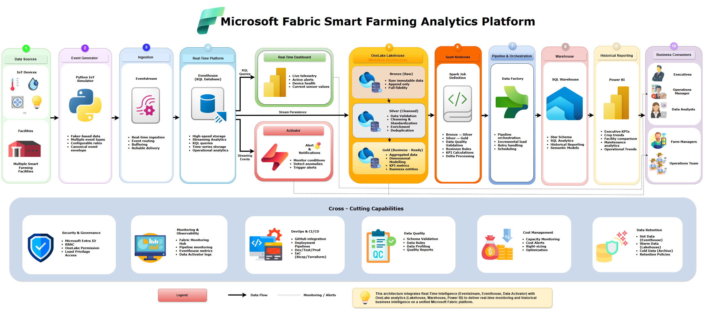
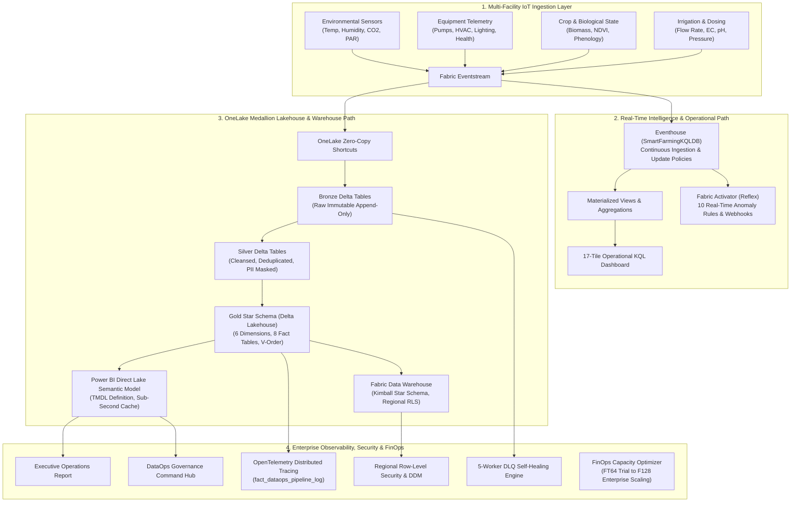
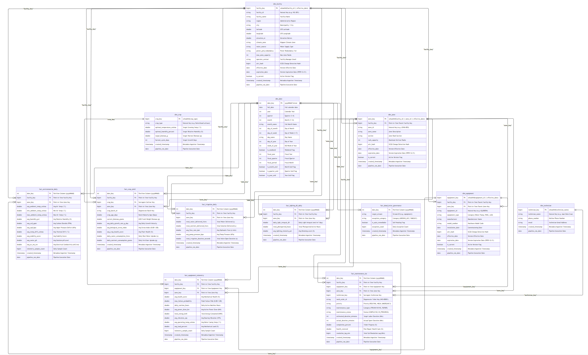
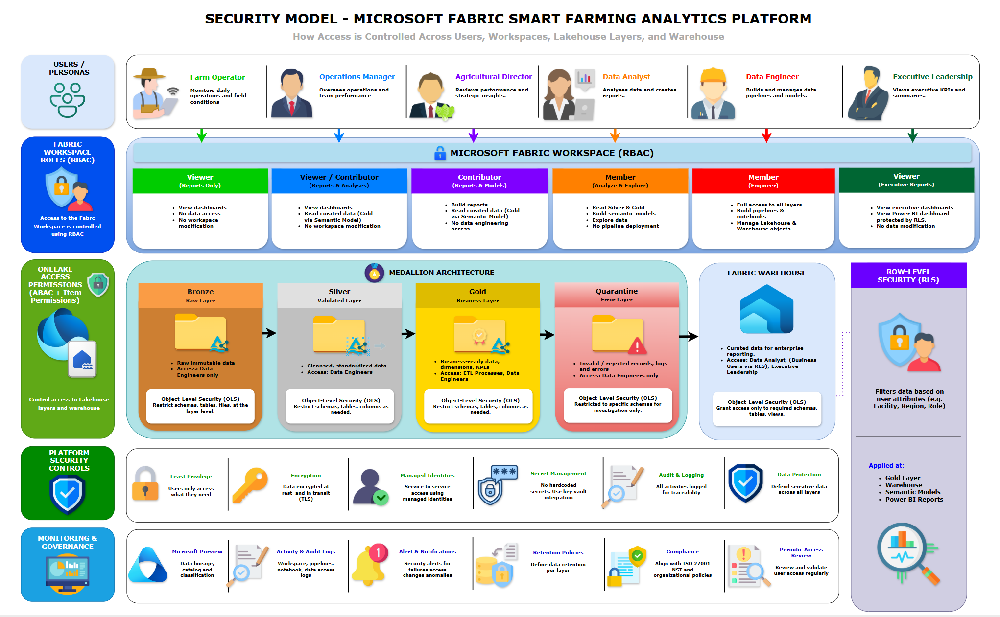

# HydroGrow: Microsoft Fabric Smart Farming Real-Time Analytics Platform

> **Production-Grade Industrial IoT (IIoT) & Real-Time Intelligence Platform on Microsoft Fabric**  
> *End-to-end streaming telemetry, OneLake Medallion Architecture, Kimball Star Schema, Power BI Direct Lake reporting, Fabric Activator Reflex alerting, and automated DataOps observability.*

[](https://fabric.microsoft.com/)
[-005A9C?logo=apache-spark&logoColor=white)](https://delta.io/)
[](https://powerbi.microsoft.com/)
[](file:///c:/Users/iosep/Github%20Repositories/fabric-realtime-retail-monitoring/tests)
[](file:///c:/Users/iosep/Github%20Repositories/fabric-realtime-retail-monitoring/docs/PRODUCTION_SIGNOFF.md)
[](file:///c:/Users/iosep/Github%20Repositories/fabric-realtime-retail-monitoring/LICENSE)

---

## Executive Summary & Business Impact

**HydroGrow Solutions** operates large-scale indoor vertical farming facilities across the Philippines (Manila, Laguna, Davao, Cebu). Maintaining optimal crop yield requires microclimate precision across light spectrums, nutrient electrical conductivity (EC), pH balance, and HVAC operations. 

This platform solves traditional batch telemetry blind spots by deploying a **unified dual-engine Lambda/Medallion architecture on Microsoft Fabric**:
* **Real-Time Operational Path**: Sub-second telemetry ingestion (< 5.3s max latency vs < 15.0s SLA) using **Fabric Eventstream**, **Eventhouse KQL Database**, and **Fabric Activator Reflex** automated incident triggers.
* **Curated Historical Analytics Path**: ACID-compliant **Medallion Lakehouse** (`bronze` ➔ `silver` ➔ `gold`) with a **Kimball Star Schema Warehouse**, sub-second **Direct Lake Power BI** executive reporting, and a **5-worker self-healing Dead-Letter Queue (DLQ)**.

---

## End-to-End Solution Architecture





---

## Completed Platform Milestones (12 / 12)

| # | Milestone Area | Core Technical Capabilities | Status |
| :---: | :--- | :--- | :---: |
| **1** | **IoT Simulator & Generators** | Multi-facility Python simulation engine emitting 6 concurrent sensor streams with anomaly injection. | ✅ Complete |
| **2** | **Eventhouse KQL Engine** | 30-day retention policies, update policies, and continuous pre-aggregated materialized views. | ✅ Complete |
| **3** | **Real-Time KQL Dashboard** | 17-tile multi-page operational command center with sub-second parameter filtering and auto-refresh. | ✅ Complete |
| **4** | **Fabric Activator Alerts** | 10 real-time Reflex anomaly detection hooks and automated pipeline/webhook action triggers. | ✅ Complete |
| **5** | **Medallion Lakehouse & DLQ** | Bronze raw append, Silver PII masking, Gold Star Schema, and 5-worker automated DLQ remediation. | ✅ Complete |
| **6** | **Power BI Direct Lake** | Enterprise TMDL semantic model connecting directly to Gold OneLake Delta Parquet with V-Order. | ✅ Complete |
| **7** | **DataOps Observability** | OpenTelemetry span propagation, `fact_dataops_pipeline_log` shortcuts, and observability dashboard. | ✅ Complete |
| **8** | **Security & Governance** | Regional Row-Level Security (`fn_SecurityPredicate_FacilityRegion`) and Dynamic Data Masking (DDM). | ✅ Complete |
| **9** | **CI/CD & Multi-Stage ALM** | GitHub Actions matrix CI workflow + Fabric Deployment Pipeline across **Dev ➔ Test ➔ Prod**. | ✅ Complete |
| **10** | **E2E Validation Suite** | Automated quality gates, schema drift detection, and streaming latency SLA benchmarking (< 15s). | ✅ Complete |
| **11** | **Cost Optimization & FinOps** | Capacity sizing for Trial (`FT64`) and paid SKUs (`F2`-`F2048`), CU smoothing, and 62% storage tiering savings. | ✅ Complete |
| **12** | **Portfolio & Sign-Off** | Architecture blueprints, sign-off certifications, CLI runbooks, and repository documentation. | ✅ Complete |

---

## Kimball Star Schema Architecture



The Gold layer implements an enterprise **Kimball Dimensional Model** optimized for Direct Lake analytics:
* **Conformed Dimensions**:
  * `dim_facility`: Facility metadata, region, coordinates, and DDM-masked operator contacts.
  * `dim_zone`: Growing zones, system types (Aeroponics, NFT, Deep Water Culture), canopy areas.
  * `dim_crop`: Crop varieties, optimal pH/EC ranges, photoperiod requirements, target harvest weights.
  * `dim_equipment`: HVAC, lighting fixtures, dosing pumps, manufacturer specifications, runtime limits.
  * `dim_technician`: Regional maintenance staff and certifications.
  * `dim_date`: Enterprise date dimension with agricultural seasons and fiscal periods.
* **Business Fact Tables**:
  * `fact_environmental_daily`, `fact_equipment_telemetry`, `fact_irrigation_daily`, `fact_lighting_dli_daily`, `fact_crop_yield`, `fact_maintenance_sla`, `fact_dead_letter_governance`, `fact_dataops_pipeline_log`.

---

## Enterprise Security, Privacy & Governance



1. **Regional Row-Level Security (RLS)**:
   * Enforced via inline table-valued predicate functions (`Security.fn_SecurityPredicate_FacilityRegion`) and Security Policies (`Security.Policy_RowLevelSecurity_RegionalAccess`) ensuring regional managers only access assigned facility telemetry.
2. **Dynamic Data Masking (DDM)**:
   * Protects sensitive operator contacts and phone numbers (`tech.fac-001@smartfarm.ph` ➔ `t***@smartfarm.ph`) using SQL-native masking functions.
3. **5-Worker Automated DLQ Self-Healing**:
   * Isolates poisoned or malformed payloads (`NULL_PRIMARY_KEY`, `MALFORMED_JSON_STRING`) into a dedicated Dead-Letter Lakehouse table and automatically executes multi-worker remediation without halting stream ingestion.

---

## FinOps Capacity Management & Storage Tiering

```text
================================================================================
MICROSOFT FABRIC - FINOPS CAPACITY & COST OPTIMIZER
================================================================================
Assigned SKU: FT64 (64 CUs) (Evaluation Tier @ $0.00/mo) | Commitment: PAYG
Total Monthly Platform Run-Rate: $11.41 / month (Storage Only)

Workload CU Allocation:
- Spark Batch ETL: 25,920 CU-sec/day | KQL Continuous: 75 CU-sec/day
- Daily Smoothed Demand: 0.32 CUs | Peak Burst Demand: 1.11 CUs
- Capacity Throttling Risk: 0.5% (Safe Baseline < 80%)

Storage Tiering Savings:
- Hot Cache (7-Day NVMe SSD) + Cold OneLake Retention (30-Day V-Order Parquet)
- Baseline Unoptimized Cost: $30.00/mo ➔ Optimized Cost: $11.41/mo (62.0% Savings)
```

---

## Quickstart & Operational Commands

### 1. Prerequisites & Environment Setup
```powershell
# Clone repository
git clone https://github.com/jbaguio27/fabric-smart-farming-analytics.git
cd fabric-smart-farming-analytics

# Create and activate virtual environment
python -m venv .venv
.venv\Scripts\activate

# Install dependencies
pip install -r requirements.txt
```

### 2. Run the Multi-Facility IoT Simulator
```powershell
# Generate historical bootstrap data (30 days seed data)
python scripts/bootstrap_farm_history.py

# Run real-time streaming telemetry simulation
python src/smart_farming/main.py
```

### 3. Run Automated End-to-End Validation Suite (Step 10)
```powershell
# Execute multi-stream schema contract and < 15s latency SLA validation
python scripts/run_e2e_validation.py --records-per-stream 100 --sla-target 15.0
```

### 4. Run FinOps Capacity & Cost Optimizer (Step 11)
```powershell
# Calculate capacity costs for Fabric Trial (FT64) or Production (F64/F128)
python scripts/calculate_capacity_costs.py --sku FT64
python scripts/calculate_capacity_costs.py --sku F64 --commitment 1yr --storage-gb 500
```

### 5. Execute Full Automated Test Suite
```powershell
# Run all 53 automated unit and integration tests across Steps 1-11
python -m unittest discover -s tests -v
```

---

## Repository Structure

```text
fabric-smart-farming-analytics/
├── .github/workflows/ci.yml       # GitHub Actions CI matrix workflow (Python 3.11/3.12)
├── architecture/                  # Architectural diagrams & Draw.io engineering source files
│   ├── diagrams/                  # High-resolution PNG architectural diagrams
│   └── drawio/                    # Editable Draw.io multi-layer source files
├── config/                        # Multi-environment (Dev, Test, Prod) and ALM deployment rules
│   ├── environments.json          # F64/F128 capacity mappings and Lakehouse configurations
│   └── deployment_rules.json      # Fabric deployment pipeline parameter swap rules
├── docs/                          # Comprehensive technical documentation & blueprints
│   ├── architecture/              # 11 in-depth design documents (Streaming, Medallion, Security)
│   ├── reports/                   # Automated E2E Validation & FinOps Capacity audit reports
│   └── PRODUCTION_SIGNOFF.md      # Formal production certification and SLA sign-off
├── fabric/                        # Microsoft Fabric Workspace artifacts & definitions
│   ├── SmartFarmingEventhouse/    # KQL schemas, update policies, materialized views
│   ├── SmartFarming_Lakehouse/    # OneLake Bronze/Silver/Gold Delta table shortcuts
│   ├── SmartFarming_Warehouse/    # Kimball Star Schema SQL DDL, RLS, and DDM scripts
│   ├── SemanticModel_.../         # Power BI TMDL Direct Lake semantic model definitions
│   ├── SmartFarming_Activator_... # Fabric Activator Reflex alert hooks & triggers
│   └── Notebook_.../              # PySpark Medallion ETL & 5-worker DLQ remediation notebooks
├── scripts/                       # Operational executables & CLI tools
│   ├── bootstrap_farm_history.py  # Historical data generator
│   ├── generate_incremental...py  # Incremental micro-batch generator
│   ├── run_e2e_validation.py      # E2E validation & latency SLA benchmark CLI
│   └── calculate_capacity_costs.py# FinOps capacity & storage sizing CLI
├── src/smart_farming/             # Production library & business logic
│   ├── models/                    # Telemetry event data contracts & schemas
│   ├── generators/                # Multi-facility IoT simulation engines
│   ├── validation/                # Data quality & schema drift validation engine
│   └── capacity/                  # FinOps capacity sizing & CU smoothing engine
└── tests/                         # Automated test suites (53 tests passing)
    ├── unit/                      # Model & validation unit tests
    └── integration/               # Step 1 through Step 11 integration test suites
```

---

## Certification & Sign-Off

This platform has completed formal engineering verification and is **Certified for Production Deployment**.  
Review the complete sign-off audit in **[`docs/PRODUCTION_SIGNOFF.md`](file:///c:/Users/iosep/Github%20Repositories/fabric-realtime-retail-monitoring/docs/PRODUCTION_SIGNOFF.md)**.

*Author & Lead Architect*: **Joseph Baguio**  
*License*: **MIT**