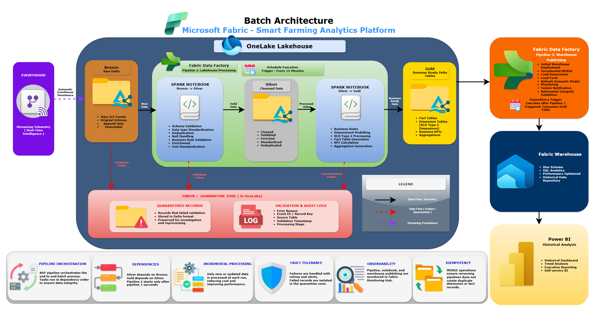

# Batch Architecture

## Document Information

| Attribute | Value |
|-----------|--------|
| Project | Microsoft Fabric Smart Farming Analytics Platform |
| Company | HydroGrow Solutions |
| Epic | Epic 1 – Project Planning & Solution Architecture |
| Version | 1.0 |
| Status | Approved |
| Author | Joseph Baguio |
| Last Updated | 2026-07-08 |

---

# Purpose

This document describes the batch processing architecture of the Microsoft Fabric Smart Farming Analytics Platform.

The batch layer transforms raw telemetry persisted in the OneLake Lakehouse into trusted business-ready datasets using the Medallion Architecture. The solution uses Microsoft Fabric Data Factory to orchestrate Spark notebooks, incremental processing, data validation, and publication into the Fabric Warehouse.

The batch architecture complements the streaming architecture by providing governed historical analytics, dimensional modeling, and enterprise reporting.

---

# Scope

This document focuses exclusively on scheduled batch processing after telemetry has been persisted from Eventhouse into the OneLake Lakehouse.

The following components are documented separately:

- Microsoft Fabric Solution Architecture
- Streaming Architecture
- Medallion Architecture
- Event Catalog
- Event Schema
- Security Model

---

# Batch Architecture Diagram

**Figure 1.** Scheduled batch processing architecture using Microsoft Fabric Data Factory, Spark Notebooks, OneLake Medallion Architecture, and Fabric Warehouse.

---

# Architecture Overview

The batch processing architecture transforms raw telemetry into trusted analytical datasets using a staged Medallion Architecture.

Processing is divided into two independent orchestration pipelines.

Pipeline 1 prepares and validates Lakehouse datasets.

Pipeline 2 publishes curated datasets into the Fabric Warehouse for enterprise reporting.

This separation improves maintainability, fault isolation, and operational monitoring.

---

# Architecture Principles

The batch architecture follows these principles:

- Separate transformation from serving.
- Preserve immutable raw data.
- Apply incremental processing.
- Isolate invalid records.
- Build reusable analytical datasets.
- Maintain complete data lineage.
- Support idempotent processing.
- Keep orchestration modular.

---

# Pipeline 1: Lakehouse Processing

## Purpose

Pipeline 1 orchestrates all Spark transformations within the OneLake Lakehouse.

Its responsibility is to transform raw Delta tables into validated and business-ready datasets.

---

## Trigger

Pipeline 1 executes on a scheduled interval using a Microsoft Fabric Data Factory schedule trigger.

Example:

Every 15 minutes

Pipeline 2 is dependency-based and executes only after Pipeline 1 completes successfully.

Future implementations may replace the schedule with event-driven execution where appropriate.

---

## Processing Stages

### Bronze → Silver

Spark Notebook performs:

- Schema validation
- Data type standardization
- Duplicate removal
- Null handling
- Unit standardization
- Timestamp normalization
- Data enrichment

Valid records are written into Silver Delta tables.

Invalid records are routed into the Quarantine Zone.

---

### Silver → Gold

Spark Notebook performs:

- Business rule implementation
- KPI calculation
- Star schema modeling
- SCD Type 2 dimension processing
- Fact table generation
- Aggregate creation

Output is written into Gold Delta tables.

---

# Data Validation and Quarantine

Invalid or failed records are never discarded.

Instead, they are written into a dedicated Quarantine Zone within OneLake.

The Quarantine Zone stores:

- Invalid records
- Validation failures
- Processing failures
- Error metadata
- Audit logs

This enables investigation, replay, and future reprocessing.

---

# Validation Logging

Each failed validation captures:

- Event ID
- Error reason
- Processing stage
- Source table
- Validation timestamp
- Pipeline execution ID

Logs support operational monitoring and auditing.

---

# Pipeline 2: Warehouse Publishing

## Purpose

Pipeline 2 publishes curated Gold datasets into the Microsoft Fabric Warehouse.

This pipeline executes only after Pipeline 1 completes successfully.

---

## Responsibilities

Pipeline 2 performs:

- Create warehouse objects (initial deployment)
- Incremental MERGE operations
- Dimension loading
- Fact loading
- Referential integrity validation
- Semantic model refresh (optional)
- Failure notification

---

## Incremental Processing

Warehouse loading uses incremental MERGE operations.

Benefits include:

- Reduced processing time
- Lower compute cost
- Idempotent execution
- Faster reporting availability

Only new or changed records are processed.

---

# Data Warehouse Integration

The Warehouse serves as the enterprise reporting layer.

It contains:

## Fact Tables

- fact_sensor_telemetry
- fact_hardware_metrics

## Dimension Tables

- dim_sensor
- dim_crop_batch
- dim_facility_structure
- dim_date
- dim_time

Dimension tables implement Slowly Changing Dimension (SCD) Type 2 where historical tracking is required.

---

# Orchestration Flow

The batch workflow executes in the following order.

1. Eventhouse continuously persists telemetry into Bronze.
2. Pipeline 1 starts on schedule.
3. Bronze is transformed into Silver.
4. Invalid records are quarantined.
5. Silver is transformed into Gold.
6. Gold datasets are validated.
7. Pipeline 2 begins after Pipeline 1 succeeds.
8. Gold datasets are incrementally merged into the Warehouse.
9. Historical Power BI dashboards are refreshed.

---

# Dependency Management

Pipeline dependencies ensure processing occurs in the correct order.

Bronze

↓

Silver

↓

Gold

↓

Warehouse

Pipeline 2 cannot begin until Pipeline 1 completes successfully.

---

# Error Handling

The batch architecture isolates failures without interrupting downstream processing.

Strategies include:

- Notebook retry policies
- Pipeline retry policies
- Quarantine of invalid records
- Failure notifications
- Execution logging

Critical failures generate monitoring alerts.

---

# Monitoring

Batch processing is monitored using:

- Fabric Monitoring Hub
- Data Factory Pipeline Monitoring
- Spark Notebook execution history
- Pipeline run history
- Validation logs
- Processing latency metrics

---

# Performance Considerations

The architecture improves performance by:

- Incremental processing
- Delta Lake storage
- Parallel Spark execution
- Modular orchestration
- Warehouse MERGE operations

---

# Scalability

The batch architecture supports:

- Additional facilities
- Larger telemetry volumes
- New event types
- Additional Spark notebooks
- Additional warehouse tables

No architectural redesign is required.

---

# Best Practices

The platform follows these batch processing best practices:

- Preserve immutable Bronze data.
- Validate before applying business rules.
- Quarantine invalid records.
- Keep Spark notebooks modular.
- Separate Lakehouse processing from Warehouse publishing.
- Use incremental MERGE operations.
- Maintain SCD Type 2 dimensions.
- Monitor every pipeline execution.

---

# Relationship to Other Architectures

The batch architecture complements the other architectural views.

| Document | Responsibility |
|----------|----------------|
| Microsoft Fabric Solution Architecture | End-to-end platform |
| Streaming Architecture | Real-time ingestion and operational analytics |
| Medallion Architecture | Lakehouse data refinement |
| Batch Architecture | Scheduled orchestration and Warehouse publishing |

---

# Architecture Summary

The batch architecture provides the governed processing layer of the Smart Farming Analytics Platform.

Using Microsoft Fabric Data Factory, Spark Notebooks, and the OneLake Medallion Architecture, raw telemetry is transformed into trusted analytical datasets while preserving complete historical lineage.

By separating Lakehouse processing from Warehouse publishing, the architecture improves maintainability, fault isolation, monitoring, and scalability. This design aligns with Microsoft Fabric best practices and establishes a reliable foundation for historical reporting, business intelligence, and future analytical workloads.