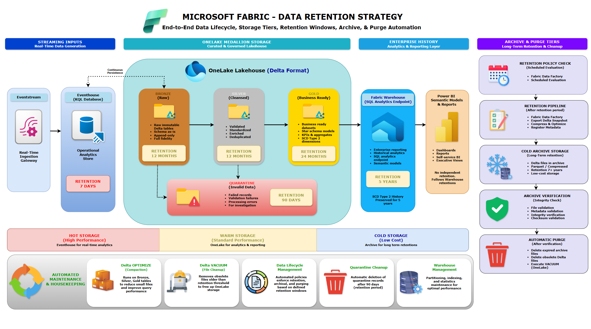

# Data Retention Strategy

## Document Information

| Attribute | Value |
|-----------|--------|
| Project | Microsoft Fabric Smart Farming Analytics Platform |
| Company | HydroGrow Solutions |
| Epic | Epic 1 – Project Planning & Solution Architecture |
| Version | 1.0 |
| Status | Approved |
| Author | Joseph Baguio |
| Last Updated | 2026-07-09 |

---

# Purpose

This document defines the data retention strategy for the Microsoft Fabric Smart Farming Analytics Platform.

The strategy governs how streaming telemetry, Lakehouse data, analytical datasets, quarantine records, and historical warehouse data are retained throughout their lifecycle.

Retention policies balance operational performance, storage cost, regulatory compliance, and historical analytics while ensuring enterprise data remains available for business reporting and auditing.

---

# Scope

This document covers retention policies for:

- Eventhouse
- OneLake Lakehouse
- Bronze Layer
- Silver Layer
- Gold Layer
- Quarantine Zone
- Fabric Warehouse
- Archived historical datasets

Power BI datasets inherit the retention policies of their underlying Warehouse data.

---

# Data Retention Strategy Diagram

**Figure 1.** End-to-end data lifecycle showing retention windows, storage tiers, archive processing, and automated lifecycle management.

---

# Data Lifecycle Overview

Telemetry progresses through multiple storage tiers during its lifecycle.

1. Real-time telemetry is ingested into Eventhouse.
2. Eventhouse automatically persists streaming data into the OneLake Bronze layer.
3. Data is refined through the Medallion Architecture.
4. Curated datasets are published into the Fabric Warehouse.
5. Historical data is archived after retention thresholds are reached.
6. Expired data is automatically removed according to lifecycle policies.

This approach ensures storage remains efficient while preserving long-term analytical history.

---

# Storage Tiers

The platform organizes data into three logical storage tiers.

## Hot Storage

Purpose:

Support low-latency operational analytics.

Components:

- Eventhouse

Characteristics:

- High-performance querying
- Streaming analytics
- Frequent access
- Short retention

Retention:

**7 Days**

---

## Warm Storage

Purpose:

Support historical processing and business analytics.

Components:

- Bronze
- Silver
- Gold
- Quarantine

Characteristics:

- Delta Lake storage
- Incremental processing
- Historical transformations
- Business reporting

---

## Cold Storage

Purpose:

Store long-term historical information at lower cost.

Components:

- Archived Delta snapshots
- Compressed historical datasets

Characteristics:

- Infrequent access
- Optimized storage
- Compliance retention
- Long-term preservation

---

# Retention Policies

| Component | Retention Period | Storage Tier |
|------------|-----------------|--------------|
| Eventhouse | 7 Days | Hot |
| Bronze | 12 Months | Warm |
| Silver | 12 Months | Warm |
| Gold | 24 Months | Warm |
| Quarantine | 90 Days | Warm |
| Fabric Warehouse | 5 Years | Enterprise History |
| Archive Storage | Organization Policy | Cold |

---

# Layer Retention Details

## Eventhouse

Retention Period:

**7 Days**

Purpose:

Maintain recent streaming telemetry for operational dashboards, alerting, and low-latency KQL analytics.

Older events are automatically persisted into OneLake before expiration.

---

## Bronze Layer

Retention Period:

**12 Months**

Stores:

- Immutable raw Delta tables
- Original event schema
- Full-fidelity telemetry

Purpose:

Support replay, auditing, troubleshooting, and future reprocessing.

---

## Silver Layer

Retention Period:

**12 Months**

Stores:

- Validated records
- Standardized data
- Enriched datasets
- Deduplicated records

Purpose:

Provide trusted datasets for downstream business transformations.

---

## Gold Layer

Retention Period:

**24 Months**

Stores:

- Fact tables
- SCD Type 2 dimensions
- Business KPIs
- Aggregated datasets
- Historical telemetry from all supported event domains

Purpose:

Support business analytics and historical trend analysis while reducing Warehouse processing requirements.

---

## Quarantine Zone

Retention Period:

**90 Days**

Stores:

- Invalid records
- Schema validation failures
- Processing failures
- Audit metadata

Purpose:

Enable investigation, replay, and controlled reprocessing before automatic cleanup.

---

## Fabric Warehouse

Retention Period:

**5 Years**

Stores:

- Enterprise star schema
- Historical dimension tables
- Historical fact tables
- Semantic model source
- Curated datasets representing all business entities and telemetry domains

Purpose:

Provide governed historical reporting and enterprise analytics.

SCD Type 2 dimensions preserve historical business changes throughout the retention period.

---

# Archive Strategy

Historical datasets exceeding operational retention periods are moved into archive storage.

The archive process includes:

- Scheduled archive pipeline execution
- Delta snapshot creation
- Compression
- Metadata registration
- Archive validation
- Integrity verification

Archived datasets remain available for regulatory or historical analysis if required.

---

# Lifecycle Automation

Retention management is automated through scheduled Microsoft Fabric Data Factory pipelines.

Automation includes:

- Retention policy evaluation
- Archive execution
- Metadata updates
- Storage optimization
- Automatic cleanup
- Failure notifications

---

# Storage Optimization

To maintain efficient storage utilization, scheduled maintenance performs:

## Delta OPTIMIZE

- Compact small files
- Improve query performance
- Reduce fragmentation

---

## Delta VACUUM

- Remove obsolete Delta files
- Reclaim storage
- Clean expired file versions

---

## Warehouse Maintenance

Scheduled maintenance includes:

- Statistics updates
- Index optimization
- Partition maintenance
- Storage monitoring

---

# Automatic Purging

Expired datasets are automatically removed after retention policies have been satisfied.

Automatic cleanup includes:

- Expired archive files
- Obsolete Delta files
- Quarantine records older than 90 days
- Delta VACUUM execution

Purging occurs only after archive verification succeeds.

---

# Compliance

The retention strategy supports:

- Historical traceability
- Data governance
- Audit readiness
- Storage cost management
- Organizational retention policies

Retention periods may be adjusted to satisfy future regulatory requirements.

---

# Monitoring

Retention processes are monitored using:

- Fabric Monitoring Hub
- Data Factory pipeline monitoring
- Archive execution logs
- Lifecycle management logs
- Storage utilization metrics
- Maintenance job history

Failures generate alerts through the platform monitoring strategy.

---

# Best Practices

The platform follows these retention best practices:

- Preserve immutable raw data.
- Archive before purging.
- Automate retention enforcement.
- Optimize Delta tables regularly.
- Execute VACUUM after retention periods.
- Retain historical business data using SCD Type 2 dimensions.
- Separate operational and historical storage.
- Monitor all lifecycle operations.

---

# Relationship to Other Architecture Documents

| Document | Responsibility |
|----------|----------------|
| Microsoft Fabric Solution Architecture | End-to-end platform |
| Streaming Architecture | Real-time telemetry ingestion |
| Medallion Architecture | Data refinement and storage |
| Batch Architecture | Scheduled processing and Warehouse publishing |
| Monitoring Strategy | Operational monitoring and alerting |
| Data Retention Strategy | Data lifecycle, archive, and purge policies |

---

# Summary

The data retention strategy governs the complete lifecycle of telemetry and analytical datasets across the Microsoft Fabric Smart Farming Analytics Platform.

By combining tiered storage, automated lifecycle management, scheduled archiving, Delta Lake optimization, and controlled purging, the platform maintains efficient storage utilization while preserving historical business data for analytics, auditing, and compliance.

The strategy aligns with Microsoft Fabric best practices and complements the platform's streaming, batch processing, monitoring, and governance architecture.