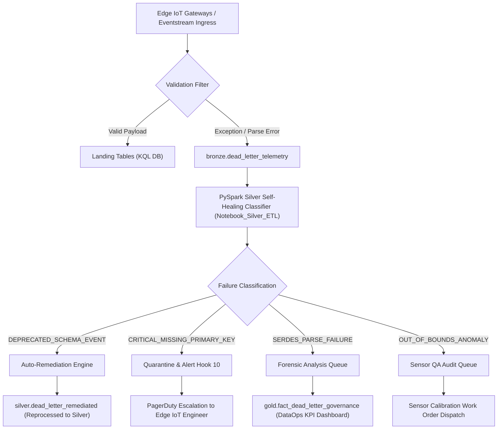

# Enterprise Dead-Letter Remediation & DataOps Governance Architecture

This document details the 4-tier failure classification, automated self-healing remediation pipeline, and Medallion flow for dead-letter telemetry in the HydroGrow Smart Farming Platform.

---

## 1. 📐 Overview & Architectural Principles

In high-throughput IoT streaming platforms, data ingress errors (missing primary keys, deprecated edge schemas, malformed JSON, sensor calibration drift) must be captured cleanly without stopping the streaming ingestion engine.

Rather than treating dead-letter queues as unmonitored dump folders, our platform implements a **4-tier automated remediation and DataOps governance lifecycle**:

---

## 2. 🚨 Failure Classifications & Remediation Policies

### Tier 1: `CRITICAL_MISSING_PRIMARY_KEY`
- **Condition**: `facility_id` or `event_id` is `NULL`, empty, or unresolvable.
- **Root Cause**: Edge gateway firmware misconfiguration or missing SAS token header.
- **Medallion Flow**:
  - Raw event landed in `bronze.dead_letter_telemetry`.
  - PySpark classifier flags row as non-auto-repairable and routes to `silver.dead_letter_quarantine`.
  - **Automated Escalation**: Triggers **Activator Hook 10** (`PagerDuty: Edge Ingress Emergency`).
- **Remediation SLA**: $< 15\text{ minutes}$ engineer intervention.

### Tier 2: `DEPRECATED_SCHEMA_EVENT`
- **Condition**: Payload uses legacy schema version (`schema_version != "1.0"`).
- **Root Cause**: Un-updated edge gateway sending legacy payload format.
- **Medallion Flow**:
  - PySpark `Notebook_Silver_ETL` extracts `raw_payload` JSON.
  - Applies automated schema transformer (renames legacy fields, injects defaults).
  - Writes recovered rows into `silver.dead_letter_remediated` and main `silver.*` target tables.
- **Automated Self-Healing Rate Target**: $> 95\%$ auto-recovery.

### Tier 3: `SERDES_PARSE_FAILURE`
- **Condition**: Corrupted JSON syntax, invalid character encoding, or truncated payload.
- **Root Cause**: Network packet truncation or edge gateway serializer crash.
- **Medallion Flow**:
  - Quarantined in `silver.dead_letter_quarantine`.
  - Preserved in raw string format for developer forensic byte inspection.

### Tier 4: `OUT_OF_BOUNDS_ANOMALY`
- **Condition**: Sensor reading exceeds physical bounds (e.g. Temperature $> 150^\circ C$).
- **Root Cause**: Hardware sensor electrical short circuit or calibration failure.
- **Medallion Flow**:
  - Quarantined in `silver.sensor_calibration_faults`.
  - Automatically creates a `ROUTINE` work order in `MaintenanceActivity` for sensor replacement.

---

## 3. 📊 Medallion Table Schema Definitions

### Bronze Layer (`bronze.dead_letter_telemetry`)
- `event_id`: Unique dead-letter identifier.
- `target_stream`: Intended stream (`EnvironmentalTelemetry`, `EquipmentTelemetry`, etc.).
- `raw_payload`: Complete unparsed JSON payload string.
- `exception_reason`: Exact error message or stack trace.
- `ingestion_timestamp`: Ingestion time UTC.

### Silver Layer (`silver.dead_letter_quarantine` & `silver.dead_letter_remediated`)
- Enriched with failure category, `is_auto_remediated` (Boolean), `retry_count`, and `remediation_timestamp`.

### Gold Layer (`gold.fact_dead_letter_governance`)
- Aggregate metrics: `dead_letter_event_count`, `auto_healing_rate_pct`, `critical_missing_key_count`, `avg_remediation_time_min` partitioned by `target_stream` and `ingestion_date`.
