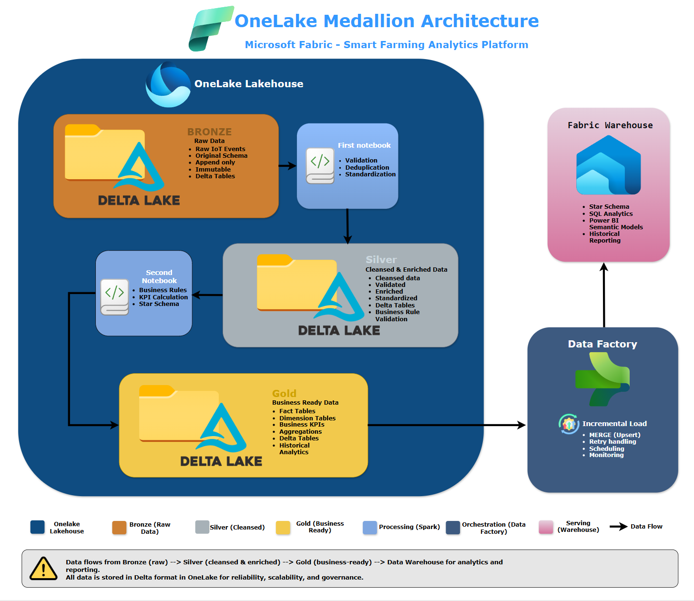

# Medallion Architecture

## Document Information

| Attribute | Value |
|-----------|--------|
| Project | Microsoft Fabric Smart Farming Analytics Platform |
| Company | HydroGrow Solutions |
| Epic | Epic 1 – Project Planning & Solution Architecture |
| Version | 1.0 |
| Status | Approved |
| Author | Joseph Baguio |
| Last Updated | 2026-07-07 |

---

# Purpose

This document describes the Medallion Architecture implemented within the Microsoft Fabric OneLake Lakehouse.

The Medallion Architecture organizes telemetry data into progressively refined layers, ensuring raw events are preserved while producing trusted, business-ready datasets for analytics and reporting.

This layered approach improves data quality, simplifies governance, and establishes a clear separation between data ingestion, transformation, and analytical consumption.

---

# Scope

This document focuses exclusively on the historical analytics pipeline implemented within the Microsoft Fabric OneLake Lakehouse.

It describes how telemetry progresses through the Bronze, Silver, and Gold layers before being published to the Fabric Warehouse for enterprise reporting.

The following components are documented separately:

- Event ingestion (Microsoft Fabric Architecture)
- Streaming pipeline (Streaming Architecture)
- Batch orchestration (Batch Architecture)
- Security model
- Monitoring strategy

---

# Medallion Architecture Diagram

**Figure 1.** Medallion Architecture implemented within the Microsoft Fabric OneLake Lakehouse.

---

# Architecture Overview

The Smart Farming Analytics Platform adopts the Medallion Architecture to progressively improve the quality and business value of incoming telemetry.

The architecture consists of three logical layers:

- Bronze
- Silver
- Gold

Each layer has a single responsibility and is transformed using dedicated Spark Notebooks.

After Gold datasets are produced, Microsoft Fabric Data Factory orchestrates incremental loading into the Fabric Warehouse.

This separation allows historical analytical processing to evolve independently from the real-time operational analytics implemented in Eventhouse.

---

# Architecture Principles

The Medallion implementation follows these principles:

- Preserve raw telemetry without modification.
- Improve data quality incrementally.
- Separate technical transformations from business logic.
- Apply business rules only to validated datasets.
- Maintain complete data lineage.
- Support incremental processing.
- Build reusable analytical datasets.

---

# Bronze Layer

## Purpose

The Bronze layer is the immutable landing zone for raw telemetry arriving from the Real-Time Intelligence platform.

No business logic is applied at this stage.

## Responsibilities

- Preserve original event payloads.
- Maintain original event schema.
- Support event replay.
- Enable auditing.
- Store raw Delta tables.
- Capture ingestion metadata.

## Characteristics

- Append-only
- Immutable
- Full event fidelity
- Schema-on-read
- Delta format

## Typical Tables

- sensor_telemetry
- hardware_metrics
- crop_batch_lifecycle
- maintenance_activity
- platform_system

---

# Bronze to Silver Transformation

Dedicated Spark Notebooks process Bronze data into validated operational datasets.

Primary transformation activities include:

- Schema validation
- Data type standardization
- Duplicate removal
- Null handling
- Timestamp normalization
- Data enrichment
- Unit standardization
- Business rule validation

Output is written into Silver Delta tables.

---

# Silver Layer

## Purpose

The Silver layer contains validated, cleansed, and standardized operational datasets.

This layer provides trusted data for downstream analytical processing while remaining independent of reporting models.

## Responsibilities

- Improve data quality.
- Standardize measurements.
- Enrich business attributes.
- Produce reusable operational datasets.
- Validate operational business rules.

## Characteristics

- Cleansed
- Validated
- Enriched
- Standardized
- Delta format
- Historical dimension tracking

---

# Silver to Gold Transformation

Dedicated Spark Notebooks transform validated operational datasets into business-ready analytical models.

Transformation activities include:

- Business rule implementation
- KPI calculation
- SCD Type 2 dimension processing
- Fact table creation
- Dimension table creation
- Aggregation generation
- Historical metric preparation

Output is written into Gold Delta tables.

---

# Gold Layer

## Purpose

The Gold layer contains curated business-ready datasets optimized for reporting and analytical workloads.

This layer implements the Kimball dimensional model adopted throughout the Smart Farming Analytics Platform.

## Responsibilities

- Create enterprise fact tables.
- Create conformed dimensions using Slowly Changing Dimension (SCD) Type 2 where historical tracking is required.
- Produce business KPIs.
- Support historical reporting.
- Provide semantic datasets for Power BI.

## Fact Tables

- fact_sensor_telemetry
- fact_hardware_metrics

## Dimension Tables

- dim_sensor
- dim_crop_batch
- dim_facility_structure

## Characteristics

- Business-ready
- Curated
- Analytical
- Delta format

---

# Warehouse Integration

The Gold layer is the authoritative source for enterprise reporting.

Microsoft Fabric Data Factory Pipelines orchestrate incremental loading of Gold datasets into the Microsoft Fabric Warehouse.

Pipeline responsibilities include:

- Incremental loading
- Pipeline orchestration
- Retry handling
- Monitoring
- Scheduling
- Failure notification

The Warehouse provides optimized SQL access for Power BI and downstream analytical workloads.

---

# Layer Responsibilities

| Layer | Primary Purpose | Transformation | Consumers |
|--------|-----------------|----------------|-----------|
| Bronze | Raw telemetry storage | None | Spark Notebooks |
| Silver | Validated operational data | Cleansing and standardization | Spark Notebooks |
| Gold | Business-ready analytical data | Business rules and dimensional modeling | Fabric Warehouse |

---

# Data Ownership

| Layer | Owner | Purpose |
|--------|--------|----------|
| Bronze | Data Engineering | Raw telemetry preservation |
| Silver | Data Engineering | Validated operational datasets |
| Gold | Analytics Engineering | Business-ready analytical datasets |
| Fabric Warehouse | BI Team | Enterprise reporting and semantic models |

---

# Data Processing Flow

Telemetry progresses through the Medallion Architecture using the following sequence:

1. Streaming telemetry is continuously persisted from Eventhouse into Bronze Delta tables.
2. Spark Notebooks validate and standardize Bronze datasets into Silver.
3. Spark Notebooks apply business transformations to produce Gold datasets.
4. Fabric Data Factory Pipelines incrementally load Gold datasets into the Fabric Warehouse.

---

# Benefits

The Medallion Architecture provides the following benefits:

- Preserves complete historical telemetry.
- Improves data quality through staged refinement.
- Simplifies troubleshooting.
- Supports scalable Spark processing.
- Enables reusable analytical datasets.
- Separates operational and business transformations.
- Improves governance and lineage.

---

# Enterprise Considerations

## Scalability

- Independent processing between Medallion layers.
- Incremental transformations reduce processing time.
- Spark processing scales with increasing telemetry volume.

## Data Quality

- Validation occurs before business logic.
- Invalid records can be quarantined.
- Duplicate events are removed prior to analytical processing.

## Governance

- Immutable raw storage.
- Complete transformation lineage.
- Clearly defined ownership for each data layer.

## Performance

- Delta Lake storage in OneLake provides efficient read and write performance for Spark workloads.
- Incremental processing minimizes resource consumption.
- Curated Gold datasets reduce reporting latency.

---

# Best Practices

The Smart Farming Analytics Platform follows these Medallion best practices:

- Preserve immutable raw data.
- Separate technical and business transformations.
- Use dedicated Spark Notebooks for each transformation stage.
- Maintain Delta format across all layers.
- Implement incremental processing.
- Keep business logic out of Bronze and Silver.
- Load only curated Gold datasets into the Warehouse.
- Avoid direct reporting from Bronze and Silver datasets.

---

# Architecture Summary

The Medallion Architecture provides a structured data refinement framework within the Microsoft Fabric OneLake Lakehouse.

By separating raw ingestion, operational validation, and business modeling into dedicated layers, the platform produces trusted analytical datasets while preserving complete historical telemetry.

The Medallion Architecture provides a governed historical analytics pipeline that complements the platform's real-time operational analytics. By progressively refining telemetry into trusted analytical datasets, the platform supports enterprise reporting, long-term trend analysis, and future analytical capabilities while preserving complete historical data lineage.