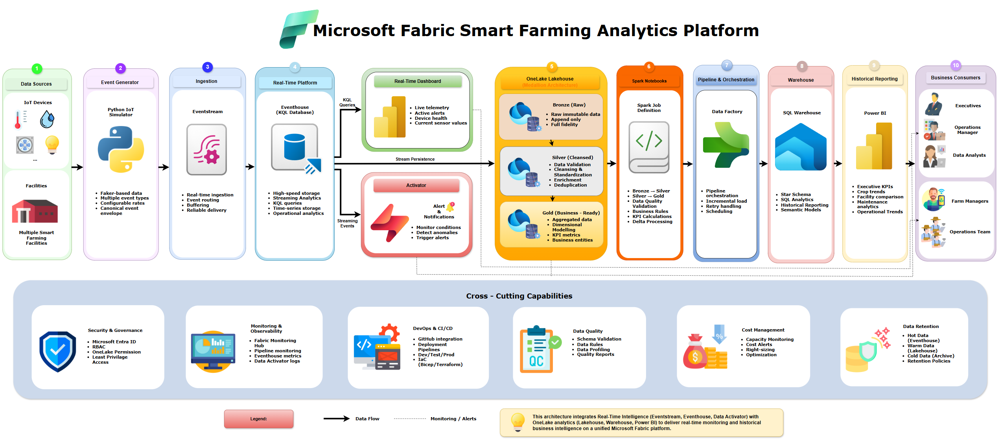

# Microsoft Fabric Solution Architecture

## Document Information

| Field | Value |
|--------|--------|
| Project | Microsoft Fabric Smart Farming Analytics Platform |
| Business | HydroGrow Solutions |
| Repository | fabric-smart-farming-analytics |
| Document Version | 1.0 |
| Status | Approved |
| Owner | Data Engineering |
| Last Updated | July 2026 |

---

# Purpose

This document describes the end-to-end Microsoft Fabric solution architecture for the Smart Farming Analytics Platform.

The architecture enables HydroGrow Solutions to collect, process, store, analyze, and visualize IoT telemetry generated from multiple smart farming facilities.

The solution combines Microsoft Fabric Real-Time Intelligence with OneLake analytics to deliver two complementary analytics workloads:

- Real-time operational monitoring through Eventhouse and KQL.
- Historical business analytics through the OneLake Medallion Architecture and Fabric Warehouse.

This architecture enables low-latency operational visibility while providing governed historical reporting from a unified Microsoft Fabric platform.

---

# Solution Architecture Diagram

**Figure 1.** End-to-end Microsoft Fabric solution architecture showing the flow of IoT telemetry from event generation through real-time analytics, historical processing, and business intelligence.

---

# Business Objectives

The architecture is designed to achieve the following objectives:

- Detect environmental issues within 15 seconds
- Monitor thousands of IoT devices simultaneously
- Support real-time operational dashboards
- Build a historical analytics platform
- Provide executive reporting through Power BI
- Maintain a single governed data platform
- Minimize operational complexity

---

# High-Level Architecture

The Smart Farming Analytics Platform follows a dual analytics architecture that separates operational and historical workloads while sharing a common streaming ingestion layer.

The platform consists of the following logical layers:

1. IoT Event Generation
2. Real-Time Ingestion
3. Operational Analytics
4. Historical Analytics
5. Business Intelligence

Figure 1 illustrates the complete end-to-end architecture.

---

# Logical Architecture

The platform consists of the following components.

## Data Producers

Enterprise IoT telemetry is generated using a configurable Python simulator.

The simulator publishes multiple event types including:

- sensor.telemetry
- hardware.metrics
- crop.batch.lifecycle
- maintenance.activity
- platform.system
- alert.critical

Each event follows the canonical event envelope defined in the Event Schema document.

---

## Eventstream

Eventstream serves as the ingestion gateway for streaming telemetry.

Responsibilities include:

- Receiving events
- Initial routing
- Event buffering
- Streaming delivery
- Integration with Eventhouse
- Custom Streaming Connector (REST API)

Eventstream is selected because it provides native integration with Microsoft Fabric Real-Time Intelligence.

Telemetry is published by the Python Event Generator using the Eventstream Custom Streaming Connector over HTTPS. This approach minimizes infrastructure while maintaining an enterprise event-driven ingestion pattern.

---

## Eventhouse

Eventhouse is the operational data store for streaming analytics.

Responsibilities include:

- High-speed event ingestion
- Time-series storage
- Real-time operational analytics
- Power BI DirectQuery datasets
- Operational dashboards
- Real-time investigation
- Data Activator integration

Eventhouse is the operational analytics platform for near real-time workloads.

It stores streaming telemetry, supports KQL-based investigations, powers operational dashboards, and provides the event source monitored by Data Activator.

Eventhouse is intentionally not the enterprise system of record. Historical data is continuously persisted into the OneLake Lakehouse for long-term storage and analytical processing.

---

## Data Activator

Data Activator continuously monitors streaming telemetry stored within Eventhouse.

Responsibilities include:

- Threshold monitoring
- Rule evaluation
- Critical event detection
- Operational notifications
- Workflow automation
- Critical incident detection

Example alerts include:

- High temperature
- Low humidity
- Water pump failure
- LED malfunction
- Sensor offline
- Abnormal pH values

---

## OneLake Lakehouse

OneLake stores historical analytical datasets following the Medallion Architecture.

Historical telemetry is continuously persisted from Eventhouse into the Bronze layer before progressing through Silver and Gold transformations.

### Bronze

Stores immutable raw telemetry.

Characteristics:

- Append-only
- Schema preservation
- Minimal transformations
- Historical replay
- Full audit trail

---

### Silver

Stores validated and standardized datasets.

Processing includes:

- Data cleansing
- Schema validation
- Deduplication
- Standardized measurement units
- Data enrichment
- Business rule validation

---

### Gold

Stores business-ready datasets optimized for analytics.

Contains:

- Fact tables
- Dimension tables
- Aggregated metrics
- Power BI semantic model source

The Gold layer follows Kimball dimensional modeling.

---

## Warehouse

The Warehouse provides SQL-based analytical access.

Primary responsibilities:

- Business reporting
- Executive analytics
- SQL analytics
- Dimensional querying
- Power BI semantic models

Warehouse consumers include:

- Operations Managers
- Farm Managers
- Executives
- Business Analysts

---

## Power BI

Power BI provides both operational and historical analytics through separate reporting models.

### Real-Time Operations Dashboard

Data Source:

- Eventhouse (KQL)

Example visualizations:

- Live sensor telemetry
- Active alerts
- Equipment status
- Environmental conditions
- Events per second

Primary users:

- Operations Team
- Farm Managers

---

### Historical Analytics & Executive Dashboards

Data Source:

- Fabric Warehouse

Example dashboards:

- Facility Performance
- Crop Yield Trends
- Equipment Reliability
- Maintenance Performance
- Executive KPI Dashboard

Primary users:

- Executives
- Business Analysts
- Operations Managers

---

# End-to-End Data Flow

The complete data flow consists of the following steps.

1. Python simulator generates IoT telemetry.
2. Events are published into Eventstream.
3. Eventstream delivers telemetry into Eventhouse.
4. Eventhouse stores streaming telemetry.
5. KQL queries power the Real-Time Operations Dashboard.
6. Data Activator evaluates streaming events for alert conditions.
7. Eventhouse persists telemetry into OneLake Bronze.
8. Spark Notebooks transform Bronze into Silver.
9. Spark Notebooks transform Silver into Gold.
10. Pipeline 2, implemented using Microsoft Fabric Data Factory, incrementally merges curated Gold Delta tables into the Fabric Warehouse after Pipeline 1 completes successfully.
11. Historical Power BI dashboards consume Warehouse models.

---

# Microsoft Fabric Services

| Service | Purpose |
|----------|---------|
| Eventstream | Streaming ingestion |
| Eventhouse | Operational streaming analytics |
| KQL Database | Streaming queries |
| Data Activator | Event-driven alerting |
| OneLake | Unified storage |
| Lakehouse | Historical data platform |
| Spark Notebooks | Data transformations |
| Fabric Data Factory | Gold to Warehouse orchestration |
| Fabric Warehouse | Enterprise SQL analytics |
| Power BI | Operational and historical dashboards |
| Deployment Pipelines | CI/CD |
| Git Integration | Source control |

---

# Design Principles

The architecture follows these principles.

## Separation of Concerns

Streaming analytics and historical analytics are isolated into separate components.

---

## Modular Processing

Each Fabric service performs a dedicated responsibility.

---

## Event-Driven Processing

Telemetry is processed immediately after generation.

---

## Governed Analytics

Historical datasets follow Medallion Architecture and Kimball dimensional modeling.

---

## Cloud-Native Design

The platform uses managed Microsoft Fabric services instead of self-managed infrastructure.

---

## Dual Analytics Architecture

Operational analytics and historical analytics are intentionally separated.

Eventhouse provides low-latency operational visibility, while the Lakehouse and Warehouse provide curated historical reporting and business intelligence.

## Single Source of Truth

Operational analytics and historical analytics consume data from dedicated platforms, ensuring each workload is optimized while maintaining consistent business definitions across reporting layers.

---

# Security Overview

The solution follows the principle of least privilege.

Key security practices include:

- Microsoft Entra ID authentication
- Workspace role-based access control
- OneLake permissions
- Warehouse SQL permissions
- Secure GitHub repository
- Managed identities where applicable

Detailed security design is documented in the Security Model.

---

# Monitoring Overview

Platform health is monitored using:

- Fabric Monitoring Hub
- Pipeline monitoring
- Eventstream metrics
- Eventhouse metrics
- Data Activator execution logs
- Power BI refresh monitoring

Detailed operational monitoring is documented in the Monitoring Strategy.

---

# Scalability Considerations

The architecture supports future growth through:

- Additional farming facilities
- Increased IoT device counts
- Additional event types
- New analytical workloads
- Expanded Power BI reporting

No architectural redesign is required when onboarding additional facilities.

---

# Cost Considerations

The architecture minimizes operational overhead by using managed Microsoft Fabric services.

Primary cost drivers include:

- Fabric Capacity (F SKU)
- Real-Time Intelligence capacity
- OneLake storage
- Spark workloads
- Warehouse compute
- Power BI capacity

Detailed financial analysis is documented in the Cost Considerations document.

---

# Architecture Summary

The Microsoft Fabric Smart Farming Analytics Platform delivers two complementary analytics capabilities.

Operational telemetry is processed through Eventstream and Eventhouse to enable near real-time monitoring, KQL analytics, operational dashboards, and automated alerting.

Historical telemetry is persisted within the OneLake Lakehouse, refined through the Medallion Architecture using Spark Notebooks, and incrementally loaded into the Fabric Warehouse for enterprise reporting.

This separation allows operational workloads to prioritize low-latency monitoring while historical workloads focus on governed reporting, trend analysis, and executive business intelligence without competing for the same analytical resources.