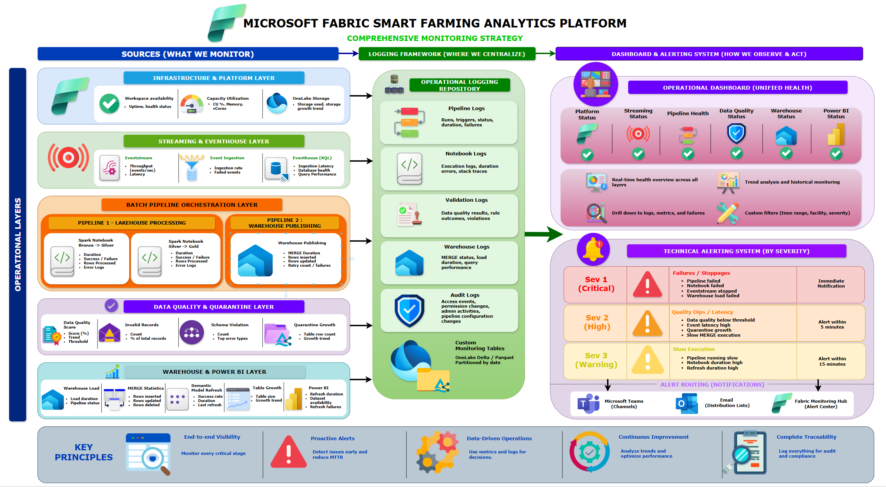

# Monitoring Strategy

## Document Information

| Attribute | Value |
|-----------|--------|
| Project | Microsoft Fabric Smart Farming Analytics Platform |
| Company | HydroGrow Solutions |
| Epic | Epic 1 – Project Planning & Solution Architecture |
| Version | 1.0 |
| Status | Approved |
| Author | Joseph Baguio |
| Last Updated | 2026-07-08 |

---

# Purpose

This document defines the monitoring and observability strategy for the Microsoft Fabric Smart Farming Analytics Platform.

The monitoring strategy provides end-to-end visibility across streaming ingestion, Lakehouse processing, warehouse publishing, data quality, and business reporting.

The platform combines Microsoft Fabric's native monitoring capabilities with a custom Platform Monitoring Dashboard to provide operational insights, proactive alerting, and centralized health reporting.

---

# Scope

The monitoring strategy covers:

- Microsoft Fabric Workspace health
- Streaming platform monitoring
- Eventhouse monitoring
- Lakehouse processing
- Spark Notebook execution
- Fabric Data Factory pipelines
- Data quality validation
- Quarantine monitoring
- Fabric Warehouse publishing
- Power BI dataset refresh
- Operational alerting
- Audit logging

The following topics are documented separately:

- Security Model
- Batch Architecture
- Streaming Architecture
- Dashboard Requirements

---

# Monitoring Strategy Diagram

**Figure 1.** End-to-end monitoring architecture spanning streaming ingestion, Lakehouse processing, warehouse publishing, and operational dashboards.

---

# Monitoring Objectives

The monitoring strategy is designed to:

- Detect failures early.
- Maintain platform reliability.
- Monitor data quality.
- Reduce operational downtime.
- Support proactive alerting.
- Improve troubleshooting.
- Provide complete operational visibility.
- Maintain auditability.

---

# Monitoring Architecture

Monitoring is organized into five operational layers.

| Layer | Primary Focus |
|--------|---------------|
| Infrastructure & Platform | Fabric Workspace, Capacity, OneLake |
| Streaming & Eventhouse | Eventstream, Eventhouse, KQL |
| Batch Processing | Spark Notebooks, Data Factory Pipelines |
| Data Quality | Validation, Quarantine, Processing Logs |
| Reporting | Warehouse and Power BI |

---

# Infrastructure & Platform Monitoring

The platform continuously monitors Microsoft Fabric infrastructure.

## Metrics

- Workspace availability
- Capacity utilization
- OneLake storage usage
- Workspace health
- Service availability

## Monitoring Source

- Fabric Monitoring Hub
- Workspace Monitoring

---

# Streaming & Eventhouse Monitoring

Streaming ingestion is monitored to ensure low-latency processing.

## Metrics

- Eventstream throughput
- Event ingestion rate
- Event processing latency
- Eventhouse ingestion latency
- Eventhouse database health
- KQL query performance

## Monitoring Source

- Eventhouse
- KQL metrics
- Fabric Monitoring Hub

---

# Batch Processing Monitoring

Batch execution is monitored across two independent orchestration pipelines.

## Pipeline 1: Lakehouse Processing

Monitored components:

- Bronze → Silver Notebook
- Silver → Gold Notebook

Metrics include:

- Notebook execution duration
- Success rate
- Failure count
- Retry count
- Processing latency
- Records processed

---

## Pipeline 2: Warehouse Publishing

Monitored components:

- Incremental MERGE
- Dimension loading
- Fact loading
- Semantic model refresh

Metrics include:

- MERGE duration
- Rows inserted
- Rows updated
- Retry count
- Pipeline execution status
- Warehouse publishing duration

---

# Data Quality Monitoring

Data quality monitoring ensures telemetry remains trustworthy throughout processing.

## Metrics

- Validation failures
- Schema violations
- Null rate
- Duplicate rate
- Invalid records
- Quarantine table growth
- Data Quality Score

Monitoring results are stored as validation logs and surfaced through the Platform Monitoring Dashboard.

---

# Warehouse & Reporting Monitoring

Enterprise reporting is monitored to ensure historical analytics remain available.

## Metrics

- Warehouse load duration
- Incremental MERGE statistics
- Table growth
- Semantic model refresh duration
- Power BI refresh duration
- Dataset availability

---

# Unified Logging Strategy

Operational telemetry from every processing stage is consolidated into a centralized logging strategy.

Log sources include:

- Spark Notebook execution
- Fabric Data Factory pipelines
- Validation logs
- Quarantine events
- Warehouse publishing
- Power BI refresh history
- Fabric activity logs

These logs provide a unified operational view for troubleshooting, auditing, and dashboard reporting.

---

# Platform Monitoring Dashboard

The Platform Monitoring Dashboard provides centralized operational visibility for the Data Engineering team.

## Dashboard Sections

### Platform Health

Displays:

- Workspace status
- Capacity utilization
- OneLake storage
- Service availability

---

### Streaming Health

Displays:

- Eventstream throughput
- Event ingestion rate
- Eventhouse latency
- KQL health

---

### Batch Processing

Displays:

Pipeline 1

- Notebook status
- Execution duration
- Processing latency

Pipeline 2

- Warehouse MERGE duration
- Rows processed
- Retry count

---

### Data Quality

Displays:

- Validation failures
- Invalid records
- Quarantine growth
- Data Quality Score

---

### Reporting Health

Displays:

- Warehouse refresh status
- Semantic model refresh
- Power BI dataset availability

---

# Alerting Strategy

Alerts are classified into three severity levels.

| Severity | Description | Examples |
|----------|-------------|----------|
| Sev 1 | Critical platform failures | Pipeline failure, Warehouse unavailable |
| Sev 2 | Performance degradation | Increased latency, Data Quality decline |
| Sev 3 | Informational | Long-running notebook, Capacity warning |

---

# Alert Destinations

Critical alerts are routed to:

- Microsoft Teams
- Email
- Fabric Monitoring Hub

Alerts include:

- Pipeline failures
- Notebook failures
- Warehouse failures
- Data Quality degradation
- Eventhouse latency
- Capacity thresholds

---

# Audit & Operational Logging

Operational logs capture:

- Pipeline execution
- Notebook execution
- Validation failures
- Warehouse publishing
- User activity
- Refresh history

Audit logs support:

- Compliance
- Troubleshooting
- Root cause analysis
- Operational reporting

---

# Monitoring Responsibilities

| Persona | Responsibilities |
|----------|------------------|
| Data Engineer | Monitor platform health, pipelines, notebooks, warehouse, and data quality |
| Operations Manager | Review operational dashboards and active alerts |
| Farm Operator | Monitor operational alerts and facility health |
| Executive Leadership | Monitor platform availability through executive reporting |

---

# Best Practices

The Smart Farming Analytics Platform follows these monitoring best practices:

- Monitor every processing stage.
- Centralize operational logs.
- Alert on failures before business impact.
- Separate operational and business dashboards.
- Track both platform health and data quality.
- Monitor pipeline execution trends.
- Review capacity utilization regularly.
- Retain audit logs for investigation.

---

# Relationship to Other Architectures

| Document | Responsibility |
|----------|----------------|
| Microsoft Fabric Solution Architecture | Overall platform architecture |
| Streaming Architecture | Real-time ingestion |
| Medallion Architecture | Lakehouse processing |
| Batch Architecture | Scheduled processing |
| Security Model | Authentication, authorization, governance |
| Monitoring Strategy | Observability and operational monitoring |

---

# Architecture Summary

The monitoring strategy provides comprehensive observability across the Microsoft Fabric Smart Farming Analytics Platform.

By combining Microsoft Fabric Monitoring Hub, Eventhouse metrics, pipeline execution history, validation logs, and a custom Platform Monitoring Dashboard, the solution delivers centralized operational visibility across streaming ingestion, Lakehouse processing, warehouse publishing, and business reporting.

This strategy enables proactive monitoring, faster incident response, improved data quality, and reliable operation of enterprise analytics workloads.