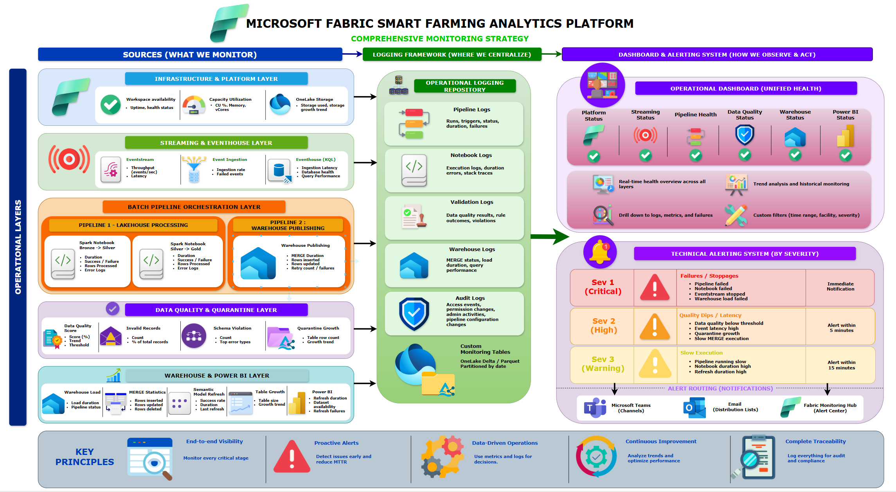

# Monitoring Strategy

## Document Information

| Attribute | Value |
|-----------|--------|
| Project | Microsoft Fabric Smart Farming Analytics Platform |
| Company | HydroGrow Solutions |
| Epic | Epic 1 – Project Planning & Solution Architecture |
| Version | 1.0 |
| Status | Approved |
| Author | Joseph Baguio |
| Last Updated | 2026-07-12 |

---

# Purpose

This document defines the monitoring and observability strategy for the Microsoft Fabric Smart Farming Analytics Platform.

The monitoring strategy provides end-to-end visibility across streaming ingestion, Lakehouse processing, warehouse publishing, data quality, and business reporting.

The platform combines Microsoft Fabric's native monitoring capabilities with a custom Platform Monitoring Dashboard to provide operational insights, proactive alerting, and centralized health reporting.

---

# Scope

The monitoring strategy covers:

- Microsoft Fabric Workspace health
- Streaming event generation
- Streaming platform monitoring
- Eventhouse monitoring
- Lakehouse processing
- Spark Notebook execution
- Fabric Data Factory pipelines
- Data quality validation
- Quarantine monitoring
- Fabric Warehouse publishing
- Power BI dataset refresh
- Operational alerting
- Audit logging

The following topics are documented separately:

- Security Model
- Batch Architecture
- Streaming Architecture
- Dashboard Requirements

---

# Monitoring Strategy Diagram

**Figure 1.** End-to-end monitoring architecture spanning streaming ingestion, Lakehouse processing, warehouse publishing, and operational dashboards.

---

# Monitoring Objectives

The monitoring strategy is designed to:

- Detect failures early.
- Maintain platform reliability.
- Monitor data quality.
- Reduce operational downtime.
- Support proactive alerting.
- Improve troubleshooting.
- Provide complete operational visibility.
- Maintain auditability.

---

# Monitoring Architecture

Monitoring is organized into five operational layers.

| Layer | Primary Focus |
|--------|---------------|
| Infrastructure & Platform | Fabric Workspace, Capacity, OneLake |
| Streaming & Eventhouse | Eventstream, Eventhouse, KQL |
| Batch Processing | Spark Notebooks, Data Factory Pipelines |
| Data Quality | Validation, Quarantine, Processing Logs |
| Reporting | Warehouse and Power BI |

---

# Infrastructure & Platform Monitoring

The platform continuously monitors Microsoft Fabric infrastructure.

## Metrics

- Workspace availability
- Capacity utilization
- OneLake storage usage
- Workspace health
- Service availability

## Monitoring Source

- Fabric Monitoring Hub
- Workspace Monitoring

---

# Streaming & Eventhouse Monitoring

Streaming ingestion is monitored to ensure low-latency processing.

## Metrics

- Eventstream throughput
- Event ingestion rate
- Event processing latency
- Eventhouse ingestion latency
- Eventhouse database health
- KQL query performance
- Events generated per event type
- Failed event publication

## Monitoring Source

- Eventhouse
- KQL metrics
- Fabric Monitoring Hub

---

# Batch Processing Monitoring

Batch execution is monitored across two independent orchestration pipelines.

## Pipeline 1: Lakehouse Processing

Monitored components:

- Bronze → Silver Notebook
- Silver → Gold Notebook

Metrics include:

- Notebook execution duration
- Success rate
- Failure count
- Retry count
- Processing latency
- Records processed

---

## Pipeline 2: Warehouse Publishing

Monitored components:

- Incremental MERGE
- Dimension loading
- Fact loading
- Semantic model refresh

Metrics include:

- MERGE duration
- Rows inserted
- Rows updated
- Retry count
- Pipeline execution status
- Warehouse publishing duration

---

# Data Quality & Anomaly Defect Rate Monitoring

Data quality monitoring ensures telemetry remains trustworthy throughout processing, tracking raw defects intentionally introduced by `DataAnomalyInjector` to validate Medallion PySpark Silver cleansing.

## Monitored Anomaly Defect Categories

- **Deduplication Rate**: Percentage of duplicate event bursts detected and dropped by PySpark `dropDuplicates(["event_id"])`.
- **Missing Value Imputation Rate**: Frequency of `null` or `"N/A"` string values requiring Silver default imputation.
- **Format Standardization Rate**: Percentage of non-standard timestamps (Epoch integer strings) standardized to ISO 8601 UTC.
- **Type Casting Defect Rate**: Volume of stringified numbers (`"97.10"`) converted back to float/double primitives during Silver processing.
- **Outlier Quarantine Volume**: Count of extreme physical outliers (e.g. `air_temp > 100°C` or `pH < 0`) routed into the `quarantine_invalid_events` Delta table.
- **Integrity Constraint Violations**: Orphaned asset events (`EQ-99999_ORPHAN`) flagged during dimensional Silver joins.

Monitoring results are stored as validation logs and surfaced through the Platform Monitoring Dashboard.

---

# Warehouse & Reporting Monitoring

Enterprise reporting is monitored to ensure historical analytics remain available.

## Metrics

- Warehouse load duration
- Incremental MERGE statistics
- Table growth
- Semantic model refresh duration
- Power BI refresh duration
- Dataset availability

---

# Unified Logging Strategy

Operational telemetry from every processing stage is consolidated into a centralized logging strategy.

Log sources include:

- Python Smart Farm Simulator
- Spark Notebook execution
- Fabric Data Factory pipelines
- Validation logs
- Quarantine events
- Warehouse publishing
- Power BI refresh history
- Fabric activity logs

These logs provide a unified operational view for troubleshooting, auditing, and dashboard reporting.

---

# Platform Monitoring Dashboard

The Platform Monitoring Dashboard provides centralized operational visibility for the Data Engineering team.

## Dashboard Sections

### Platform Health

Displays:

- Workspace status
- Capacity utilization
- OneLake storage
- Service availability

---

### Streaming Health

Displays:

- Eventstream throughput
- Event ingestion rate
- Events generated by type
- Event publication failures
- Eventhouse latency
- KQL health

---

### Batch Processing

Displays:

Pipeline 1

- Notebook status
- Execution duration
- Processing latency

Pipeline 2

- Warehouse MERGE duration
- Rows processed
- Retry count

---

### Data Quality

Displays:

- Validation failures
- Invalid records
- Quarantine growth
- Data Quality Score

---

### Reporting Health

Displays:

- Warehouse refresh status
- Semantic model refresh
- Power BI dataset availability

---

# Alerting Strategy (Fabric Activator 10-Hook Engine)

The platform deploys 10 production Fabric Activator alert hooks across 4 severity levels:

| Hook # | Alert Name | Target Persona | Severity | Trigger Condition & Threshold | Notification Channel | Remediation Action |
| :--- | :--- | :--- | :---: | :--- | :--- | :--- |
| **Hook 1** | **Executive Facility Emergency** | Executive / Ops Lead | 🟥 `EMERGENCY` | `facility_health_score < 65.0` OR `active_critical_alerts > 0` | Teams + SMS | Trigger emergency operational response; inspect primary facility power and HVAC systems. |
| **Hook 2** | **Facility Power Surge SLA** | Operations / Energy | 🟧 `CRITICAL` | `total_power_consumption_kw > 450.0` | Teams + Email | Load-shed non-critical lighting or secondary pumps to avoid electrical grid penalties. |
| **Hook 3** | **Critical Equipment Failure Imminent** | Maintenance / Reliability | 🟥 `EMERGENCY` | `equipment_risk_score > 75.0` OR `critical_failure_count > 0` | Email + PagerDuty | Immediately dispatch field technician to inspect failing water pump or HVAC compressor. |
| **Hook 4** | **Micro-Climate Instability** | Agronomist / Greenhouse | 🟨 `WARNING` | `microclimate_stability_score < 70.0%` OR `abs(avg_temp_drift_c) > 3.0` | Teams | Adjust HVAC setpoints and ventilation fan speeds in affected growing zones. |
| **Hook 5** | **Crop Biological Stress Spike** | Chief Agronomist | 🟧 `CRITICAL` | `biological_stress_pct > 40.0%` OR `crop_health_score < 70.0` | Teams + Email | Inspect hydroponic nutrient EC/pH dosing pumps and check for root rot or tip-burn. |
| **Hook 6** | **Work Order Resolution SLA Breach** | Maintenance Lead | 🟨 `WARNING` | `emergency_order_count > 0` AND `avg_resolution_minutes > 120.0` | Teams | Re-assign pending high-priority work orders to available field technicians. |
| **Hook 7** | **Stream Processing Lag SLA Breach** | DataOps Lead / Streaming | 🟥 `CRITICAL` | `avg_processing_lag_sec > 5.0s` OR `sla_breach_count > 0` | PagerDuty + Teams | Investigate Eventstream HTTP ingestion bottleneck or KQL update policy execution. |
| **Hook 8** | **Ingress Schema Quality Breach** | Data Quality Steward | 🟨 `WARNING` | `data_quality_score < 98.0%` OR `null_facility_count > 0` | Teams + Email | Inspect IoT edge gateway payload serialization for missing `facility_id` fields. |
| **Hook 9** | **Dead-Letter Queue Exception Burst** | Platform Architect | 🟧 `CRITICAL` | `dead_letter_count > 5` per 15 minutes | Teams | Review `DeadLetterTelemetry` payload exception logs for deprecated schema events. |
| **Hook 10** | **Critical Missing Primary Key Ingress**| Edge IoT Engineer | 🟥 `EMERGENCY` | `exception_status == "CRITICAL_MISSING_PRIMARY_KEY"` count `> 0` | PagerDuty + Teams | Audit edge gateway firmware and re-issue facility identifier tokens. |

---

# Alert Fatigue Prevention & Cooldown Policies

To prevent notification spamming in real-time streaming environments:
- **Deduplication Cooldown Window**: 15 minutes per facility / stream.
- **Alert Suppression**: Once an alert triggers, subsequent identical events within the 15-minute window are suppressed.
- **Auto-Resolution**: When metrics return below warning thresholds for 2 consecutive cycles, an `RESOLVED` heartbeat notice is dispatched to Teams.

---

# Alert Destinations & Channel Routing

Critical alerts are routed to:
- **Microsoft Teams**: `#ops-emergency-escalation`, `#agronomy-alerts`, `#dataops-alerts`
- **Email**: `field-dispatch@hydrogrow.com`, `agronomy-leads@hydrogrow.com`
- **PagerDuty**: Critical stream SLA lag breaches and edge primary key missing incidents.

---

# Audit & Operational Logging

Operational logs capture:

- Pipeline execution
- Notebook execution
- Validation failures
- Warehouse publishing
- User activity
- Refresh history

Audit logs support:

- Compliance
- Troubleshooting
- Root cause analysis
- Operational reporting

---

# Monitoring Responsibilities

| Persona | Responsibilities |
|----------|------------------|
| Data Engineer | Monitor simulator health, event generation, platform health, pipelines, notebooks, warehouse, and data quality |
| Operations Manager | Review operational dashboards and active alerts |
| Farm Operator | Monitor operational alerts and facility health |
| Executive Leadership | Monitor platform availability through executive reporting |

---

# Best Practices

The Smart Farming Analytics Platform follows these monitoring best practices:

- Monitor every processing stage.
- Centralize operational logs.
- Alert on failures before business impact.
- Separate operational and business dashboards.
- Track both platform health and data quality.
- Monitor pipeline execution trends.
- Review capacity utilization regularly.
- Retain audit logs for investigation.

---

# Relationship to Other Architectures

| Document | Responsibility |
|----------|----------------|
| Microsoft Fabric Solution Architecture | Overall platform architecture |
| Streaming Architecture | Real-time ingestion |
| Medallion Architecture | Lakehouse processing |
| Batch Architecture | Scheduled processing |
| Security Model | Authentication, authorization, governance |
| Monitoring Strategy | Observability and operational monitoring |

---

# Architecture Summary

The monitoring strategy provides comprehensive observability across the Microsoft Fabric Smart Farming Analytics Platform.

By combining Python simulator logs, Microsoft Fabric Monitoring Hub, Eventhouse metrics, pipeline execution history, validation logs, and a custom Platform Monitoring Dashboard, the solution delivers centralized operational visibility across event generation, streaming ingestion, Lakehouse processing, warehouse publishing, and business reporting.

This strategy enables proactive monitoring, faster incident response, improved data quality, and reliable operation of enterprise analytics workloads.