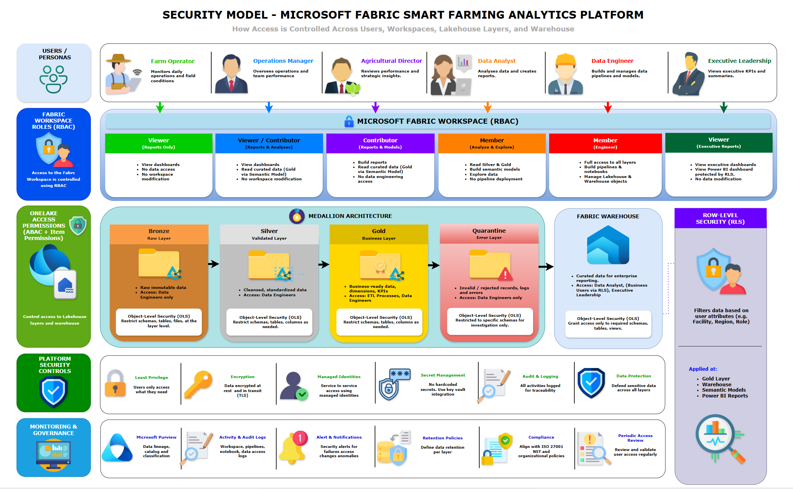

# Security Model

## Document Information

| Attribute | Value |
|-----------|--------|
| Project | Microsoft Fabric Smart Farming Analytics Platform |
| Company | HydroGrow Solutions |
| Epic | Epic 1 – Project Planning & Solution Architecture |
| Version | 1.0 |
| Status | Approved |
| Author | Joseph Baguio |
| Last Updated | YYYY-MM-DD |

---

# Purpose

This document defines the security architecture for the Microsoft Fabric Smart Farming Analytics Platform.

The platform applies layered security controls across data ingestion, storage, processing, analytics, and reporting. The objective is to protect telemetry data, enforce least privilege access, maintain auditability, and support secure collaboration across engineering and business teams.

---

# Security Architecture Diagram



**Figure 1.** Security architecture illustrating authentication, authorization, workspace permissions, OneLake access controls, Object-Level Security (OLS), Row-Level Security (RLS), and governance across the Microsoft Fabric Smart Farming Analytics Platform.

---

# Scope

This document covers security controls implemented throughout the Microsoft Fabric platform, including:

- Identity and authentication
- Authorization
- Workspace security
- Data access
- Lakehouse security
- Warehouse security
- Power BI security
- Data protection
- Audit and monitoring

The following topics are documented separately:

- Microsoft Fabric Solution Architecture
- Streaming Architecture
- Batch Architecture
- Monitoring Strategy

---

# Security Principles

The platform follows these security principles:

- Least privilege access
- Defense in depth
- Zero Trust
- Role-Based Access Control (RBAC)
- Separation of duties
- Secure by default
- Complete auditability

---

# Identity and Authentication

Authentication is provided through Microsoft Entra ID.

All users accessing Microsoft Fabric must authenticate using organizational identities.

Supported authentication includes:

- Microsoft Entra ID
- Multi-Factor Authentication (MFA)
- Conditional Access Policies

No custom authentication mechanism is implemented.

---

# Authorization Model

Authorization is enforced using Microsoft Fabric Role-Based Access Control (RBAC).

Permissions are assigned based on business responsibilities rather than individual users.

Access follows the principle of least privilege.

---

# Workspace Security

The Microsoft Fabric workspace contains all project assets.

Access is controlled using Fabric workspace roles.

| Role | Responsibilities |
|------|------------------|
| Admin | Workspace administration |
| Member | Data engineering development |
| Contributor | Report development |
| Viewer | Dashboard consumption |

Workspace administrators are responsible for permission management and governance.

---

# Data Access Model

The platform separates access according to data sensitivity.

| Layer | Access Model |
|--------|--------------|
| Eventhouse | Operational monitoring |
| Bronze | Data Engineering only |
| Silver | Data Engineering |
| Gold | Data Engineering and Data Analysts |
| Warehouse | Business reporting |
| Power BI | Business consumers |

Raw telemetry is never exposed directly to business users.

---

# Lakehouse Security

The OneLake Lakehouse is protected through Microsoft Fabric permissions.

Access policies include:

## Bronze

Accessible only by Data Engineers.

Contains immutable raw telemetry.

## Silver

Accessible by Data Engineers.

Contains validated operational datasets.

## Gold

Accessible by Data Engineers and Data Analysts.

Contains curated business datasets.

## Quarantine Zone

Restricted to Data Engineers.

Contains invalid records, processing failures, and validation logs.

Business users have no access.

---

# Warehouse Security

The Fabric Warehouse provides governed SQL access.

Security controls include:

- SQL permissions
- Read-only reporting access
- Controlled schema modification
- Managed warehouse roles

Only Data Engineers may modify warehouse objects.

---

# Power BI Security

Power BI reports inherit Microsoft Fabric permissions.

Security controls include:

- Workspace permissions
- Role-based report access
- Dataset permissions
- Row-Level Security (future enhancement)

Operational dashboards expose only authorized information.

---

# Service-to-Service Security

Internal Microsoft Fabric services communicate using managed identities where supported.

Examples include:

- Eventhouse to OneLake persistence
- Data Factory pipeline execution
- Spark Notebook execution
- Warehouse loading

No embedded credentials are stored in notebooks or pipelines.

---

# Data Protection

The platform protects data using Microsoft Fabric security capabilities.

Controls include:

- Encryption at rest
- Encryption in transit (HTTPS/TLS)
- Secure OneLake storage
- Managed storage services

Telemetry data is encrypted throughout the platform.

---

# Secrets Management

The solution avoids hardcoded credentials.

Configuration values are stored separately from application code.

Future implementations may integrate Azure Key Vault for centralized secret management.

---

# Auditing and Logging

Security-relevant activities are logged.

Examples include:

- Pipeline executions
- Workspace administration
- Permission changes
- Data validation failures
- Warehouse loading
- Spark Notebook execution

Audit logs support investigation and compliance.

---

# Network Security

The platform relies on Microsoft Fabric managed networking.

Communication occurs over secure HTTPS connections.

No public database endpoints are exposed.

The Python simulator publishes telemetry through secure HTTPS connections to Eventstream.

---

# Role Mapping

| Persona | Primary Access |
|----------|----------------|
| Farm Operator | Power BI Operational Dashboards |
| Operations Manager | Operational Dashboards and Warehouse Reports |
| Agricultural Director | Historical Analytics |
| Data Analyst | Gold Lakehouse and Warehouse |
| Data Engineer | Eventhouse, Lakehouse, Warehouse, Pipelines |
| Executive Leadership | Executive Dashboards |

---

# Security Boundaries

The platform enforces logical security boundaries.

```text
Python Simulator
        │
        ▼
Eventstream
        │
        ▼
Eventhouse
        │
──────── Security Boundary ────────
        │
        ▼
OneLake
    Bronze
    Silver
    Gold
    Quarantine
──────── Security Boundary ────────
        │
        ▼
Warehouse
──────── Security Boundary ────────
        │
        ▼
Power BI
```

Each layer exposes only the minimum required access.

---

# Compliance Considerations

The platform supports governance through:

- Centralized identity management
- RBAC
- Audit logging
- Data lineage
- Version-controlled infrastructure
- Secure development practices

Future enhancements may include:

- Purview integration
- Sensitivity labels
- Data Loss Prevention (DLP)
- Automated compliance monitoring

---

# Security Best Practices

The Smart Farming Analytics Platform follows these best practices:

- Enforce least privilege access.
- Protect raw telemetry from direct business access.
- Separate operational and analytical workloads.
- Use managed identities where supported.
- Encrypt data in transit and at rest.
- Log administrative activities.
- Restrict access to quarantine data.
- Store business users on curated datasets only.
- Avoid hardcoded credentials.
- Review permissions regularly.

---

# Relationship to Other Architecture Documents

| Document | Responsibility |
|----------|----------------|
| Microsoft Fabric Solution Architecture | Overall platform architecture |
| Streaming Architecture | Real-time ingestion |
| Batch Architecture | Scheduled processing |
| Medallion Architecture | Data refinement |
| Security Model | Identity, authorization, and data protection |

---

# Security Summary

The Smart Farming Analytics Platform applies layered security controls across Microsoft Fabric to protect operational telemetry and analytical datasets.

Authentication is managed through Microsoft Entra ID, authorization is enforced using Role-Based Access Control, and access is restricted according to business responsibilities. Raw telemetry remains protected within the Lakehouse, while curated datasets are securely published through the Warehouse and Power BI.

This security model aligns with Microsoft Fabric best practices and provides a secure foundation for real-time operations, historical analytics, and future platform growth.