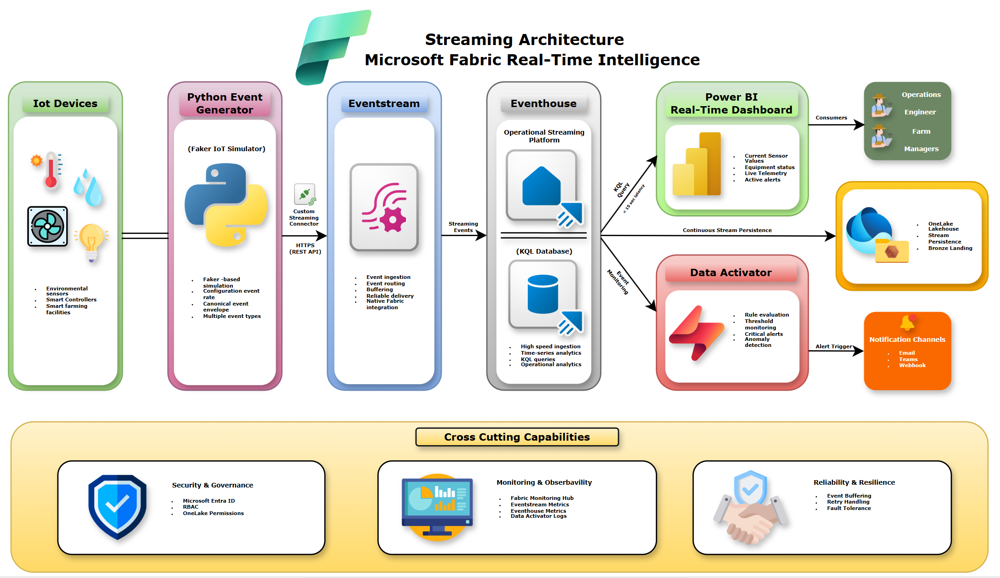

# Streaming Architecture

## Document Information

| Field | Value |
|--------|--------|
| Project | Microsoft Fabric Smart Farming Analytics Platform |
| Business | HydroGrow Solutions |
| Repository | fabric-smart-farming-analytics |
| Document Version | 1.0 |
| Status | Approved |
| Owner | Data Engineering |
| Last Updated | 2026-07-12 |

---

# Purpose

This document describes the streaming architecture used by the Microsoft Fabric Smart Farming Analytics Platform.

The streaming architecture enables HydroGrow Solutions to ingest, process, analyze, and monitor IoT telemetry with sub-minute latency. It combines Microsoft Fabric Real-Time Intelligence services to provide operational visibility, proactive alerting, and continuous persistence of telemetry for historical analytics.

This architecture is designed to support thousands of concurrently connected IoT devices while maintaining low operational complexity through fully managed Microsoft Fabric services.

---

# Streaming Architecture Diagram

**Figure 1.** End-to-end streaming architecture illustrating real-time event ingestion, operational analytics, alerting, and continuous persistence into OneLake.

---

# Business Objectives

The streaming architecture supports the following business objectives:

- Detect environmental anomalies in less than 15 seconds.
- Monitor thousands of IoT sensors concurrently.
- Enable live operational dashboards.
- Trigger real-time notifications for critical events.
- Persist streaming telemetry for historical analytics.
- Minimize operational overhead through managed Fabric services.

---

# Streaming Architecture Overview

The platform follows an event-driven streaming architecture.

IoT telemetry generated by smart farming facilities is continuously published into Microsoft Fabric Eventstream through the Python Smart Farm Simulator.

The simulator consists of multiple independent event generators that emulate environmental sensors, irrigation systems, equipment assets, crop lifecycle events, maintenance activities, platform events, and operational alerts. Each generator publishes events using the project's canonical event envelope.

Eventstream performs real-time ingestion and routing before forwarding telemetry to Eventhouse, which serves as the operational streaming platform.

From Eventhouse, telemetry is simultaneously consumed by:

- Power BI Real-Time Dashboard for live operational monitoring.
- Data Activator for event-driven alerting.
- OneLake Lakehouse for historical persistence.

This architecture separates operational analytics from historical analytics while maintaining a unified Microsoft Fabric platform.

---

# End-to-End Streaming Flow

The streaming workflow consists of the following stages:

1. Simulated business entities generate environmental, irrigation, equipment, crop lifecycle, maintenance, platform, and alert events.
2. The Python Smart Farm Simulator uses independent event generators and Faker to produce realistic enterprise IoT telemetry.
3. Events are published to Eventstream through the Custom Streaming Connector using HTTPS REST APIs.
4. Eventstream validates, buffers, and routes incoming events.
5. Eventhouse ingests streaming telemetry into a KQL Database.
6. Power BI queries Eventhouse using KQL for real-time operational dashboards.
7. Data Activator continuously evaluates incoming events against alert rules.
8. Critical events trigger notifications for operational teams.
9. Eventhouse continuously persists telemetry into the Bronze layer of the OneLake Lakehouse.
10. Historical processing begins within the Medallion Architecture.

---

# Architecture Components

## IoT Devices

The platform simulates enterprise-scale IoT infrastructure deployed across multiple smart farming facilities.

Example devices include:

- Temperature sensors
- Humidity sensors
- pH sensors
- Water pumps
- HVAC systems
- LED grow lights
- Environmental controllers
- Irrigation valves
- Flow meters
- Water reservoirs

These devices continuously produce telemetry representing environmental conditions and equipment health.

---

## Python Smart Farm Simulator

The Python Smart Farm Simulator simulates enterprise IoT telemetry.

Responsibilities include:

- Managing multiple independent event generators
- Generating realistic IoT telemetry
- Maintaining persistent business entities
- Producing multiple event types
- Applying configurable event rates
- Publishing canonical event envelopes
- Sending events through the Eventstream Custom Streaming Connector

The simulator allows the platform to emulate enterprise workloads without requiring physical hardware.

---

## Eventstream

Eventstream is the streaming ingestion layer.

Responsibilities include:

- Real-time event ingestion
- Event routing
- Event buffering
- Reliable event delivery
- Native integration with Microsoft Fabric Real-Time Intelligence

Eventstream provides a managed ingestion service that eliminates the need for custom messaging infrastructure.

---

## Eventhouse

Eventhouse serves as the operational streaming platform.

The KQL Database stores streaming telemetry for low-latency analytics and investigation.

Responsibilities include:

- High-speed ingestion
- Time-series analytics
- KQL querying
- Operational dashboards
- Continuous stream persistence
- Integration with Data Activator

Eventhouse is optimized for operational analytics rather than long-term analytical storage.

---

## Power BI Real-Time Dashboard

Power BI consumes streaming telemetry directly from Eventhouse.

Operational dashboards provide:

- Current sensor values
- Equipment status
- Active alerts
- Live environmental monitoring

These dashboards enable operations teams to monitor facility health in near real time.

---

## Data Activator

Data Activator continuously evaluates streaming telemetry against business rules.

Responsibilities include:

- Rule evaluation
- Threshold monitoring
- Anomaly detection
- Critical event detection
- Notification triggering

Example alert conditions include:

- High temperature
- Low humidity
- Water pump failure
- Sensor offline
- LED malfunction
- Abnormal pH values
- Irrigation flow interruption
- Low reservoir level

---

## Notification Channels

Critical events generate notifications for operational personnel.

Supported notification channels include:

- Microsoft Teams
- Email
- Webhooks

These notifications enable rapid response to operational incidents.

---

## OneLake Lakehouse

Streaming telemetry is continuously persisted into the Bronze layer of the Lakehouse.

Responsibilities include:

- Historical event persistence
- Immutable raw storage
- Replay capability
- Downstream analytical processing

Historical transformations are documented separately in the Medallion Architecture document.

---

# Data Flow Characteristics

| Characteristic | Description |
|---------------|-------------|
| Processing Model | Event-driven streaming |
| Ingestion Pattern | Continuous |
| Event Ordering | Best effort |
| Storage Model | Append-only |
| Operational Latency Target | Less than 15 seconds |
| Historical Persistence | Continuous |
| Event Replay | Supported through Bronze layer |

---

# Streaming Design Principles

## Event-Driven Processing

Telemetry is processed immediately after ingestion without waiting for scheduled batch windows.

---

## Separation of Operational and Historical Analytics

Operational analytics occur within Eventhouse.

Historical analytics occur within the OneLake Lakehouse.

This separation allows each platform to specialize in its intended workload.

---

## Low-Latency Analytics

Operational dashboards and alerts consume streaming telemetry directly from Eventhouse without requiring intermediate transformations.

---

## Immutable Historical Storage

Raw telemetry is persisted into the Bronze layer without modification, preserving a complete historical audit trail.

---

## Managed Platform Services

The architecture prioritizes managed Microsoft Fabric services to reduce operational complexity and infrastructure maintenance.

---

# Monitoring and Observability

Streaming workloads are monitored using:

- Fabric Monitoring Hub
- Eventstream metrics
- Eventhouse metrics
- Data Activator execution logs

Operational monitoring includes:

- Events generated by type
- Event ingestion throughput
- Processing latency
- Alert execution status
- Streaming failures
- Event publication failures
- Event delivery health

---

# Scalability Considerations

The streaming architecture supports future expansion through:

- Additional farming facilities
- Increased IoT device counts
- Additional business entities
- Higher event throughput
- New event types
- Additional operational dashboards

The architecture scales horizontally using managed Microsoft Fabric services without requiring application redesign.

---

# Security Overview

Streaming services follow enterprise security practices including:

- Microsoft Entra ID authentication
- Workspace role-based access control
- Least privilege access
- Secure REST API communication
- OneLake permissions

Detailed security controls are documented in the Security Model.

---

# Related Documentation

- Architecture Decisions
- Microsoft Fabric Architecture
- Medallion Architecture
- Security Model
- Monitoring Strategy
- Event Schema
- Event Catalog

---

# Architecture Summary

The streaming architecture provides HydroGrow Solutions with a low-latency operational analytics platform built on Microsoft Fabric Real-Time Intelligence.

By combining the Python Smart Farm Simulator, Eventstream, Eventhouse, Data Activator, Power BI, and OneLake, the platform supports continuous telemetry generation, live operational monitoring, proactive alerting, and historical persistence within a unified enterprise architecture.

This design satisfies the business objective of reducing operational visibility latency from 24 hours to less than 15 seconds while providing a scalable foundation for future smart farming expansion.