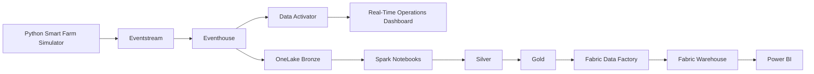

# Event Schema

**Document Owner:** Data Engineering Team

**Version:** 1.0

**Status:** Approved

**Last Updated:** 2026-07-16

---

## Table of Contents

1. Purpose
2. Scope
3. Intended Audience
4. Related Documents
5. Canonical Event Contract
6. Common Metadata Field Dictionary
7. Data Type Standards
8. Enumerations
9. Global Validation Standards

---

# Purpose

This document defines the canonical event schemas used throughout the Microsoft Fabric Smart Farming Analytics Platform.

The Event Schema serves as the authoritative contract between all event producers and consumers within the platform. Every streaming event generated by the Python Smart Farm Simulator must conform to the schemas defined in this document before entering the Microsoft Fabric ecosystem.

These schemas provide a standardized structure for ingestion, validation, storage, analytics, monitoring, and downstream reporting. They also establish governance practices that enable schema evolution while maintaining compatibility across platform components.

This document supports the implementation of:

- Python Smart Farm Simulator
- Microsoft Fabric Eventstream
- Eventhouse (KQL Database)
- OneLake
- Lakehouse
- Spark Notebooks
- Warehouse
- Power BI
- Data Activator

---

# Scope

This document defines:

- Canonical event structure
- Common metadata shared by all events
- Event payload schemas
- Field definitions
- Data types
- Required and optional fields
- Validation rules
- Enumerated values
- Naming conventions
- Schema versioning strategy
- Data lineage requirements

The document does not define:

- KQL table creation scripts
- Spark transformation logic
- SQL Warehouse models
- Power BI semantic models

Those implementation details are documented separately within their respective architecture and implementation guides.

---

# Intended Audience

This document is intended for:

- Data Engineers
- Analytics Engineers
- Software Engineers
- Platform Engineers
- Solution Architects
- BI Developers
- Data Governance Teams

---

# Related Documents

This document should be read together with the following project documentation:

- Business Scenario
- Functional Requirements
- Non-Functional Requirements
- User Personas
- Business KPIs
- KPI Mapping Matrix
- Event Catalog
- Architecture Decisions
- Microsoft Fabric Architecture
- Medallion Architecture
- Streaming Architecture
- Security Model

---

# Canonical Event Contract

Every event generated by the Smart Farming Analytics Platform follows a common event envelope.

The canonical event contract ensures every producer emits events using a consistent structure while allowing each event type to define its own business-specific payload.

This design simplifies:

- Eventstream routing
- Eventhouse ingestion
- Schema evolution
- Data lineage
- Monitoring
- Validation
- Downstream transformations

## Canonical Event Structure

```json
{
  "event_id": "d8dbed93-2bb5-4d2f-aee0-b053b4d7543b",
  "event_type": "sensor.telemetry",
  "event_timestamp": "2026-07-01T10:30:15Z",
  "ingestion_timestamp": null,
  "schema_version": "1.0",
  "facility_id": "FACILITY-NY-01",
  "zone_id": "ZONE-A",
  "correlation_id": "5b3bb60e-1fa4-43d8-bfa8-8d5342e6593e",
  "producer_id": "smart-farm-simulator",
  "environment": "DEV",
  "payload": {
    "<event-specific-fields>"
  }
}
```

---

# Common Metadata Field Dictionary

| Field | Type | Required | Description |
|--------|------|----------|-------------|
| event_id | UUID | Yes | Globally unique identifier for the event. |
| event_type | String | Yes | Business event classification. |
| event_timestamp | ISO 8601 UTC | Yes | Time the event was generated by the producer. |
| ingestion_timestamp | ISO 8601 UTC | No | Timestamp assigned by Microsoft Fabric during ingestion. |
| schema_version | String | Yes | Version of the event schema. |
| facility_id | String | Yes | Identifier of the smart farming facility generating the event. |
| zone_id | String | Yes | Climate-controlled growing zone where the event originated. |
| correlation_id | UUID | Yes | Identifier used to correlate related events within the same workflow or crop batch. |
| producer_id | String | Yes | Application or device responsible for generating the event. |
| environment | Enum | Yes | Deployment environment. |
| payload | JSON Object | Yes | Business-specific event payload. |

---

# Data Type Standards

| Data Type | Standard |
|-----------|----------|
| UUID | RFC 4122 |
| DateTime | ISO 8601 UTC |
| Date | ISO 8601 (YYYY-MM-DD) |
| String | UTF-8 |
| Integer | 64-bit signed integer |
| Decimal | Double precision |
| Boolean | true / false |
| Enum | Uppercase values |
| Object | JSON Object |
| Array | JSON Array |

---

# Enumerations

## Environment

| Value | Description |
|-------|-------------|
| DEV | Development environment |
| TEST | Test environment |
| PROD | Production environment |

---

## Data Quality Flag

| Value | Description |
|-------|-------------|
| GOOD | Record passed all validation checks. |
| MISSING_VALUE | One or more required measurements were missing. |
| OUT_OF_BOUNDS | Measurement exceeded acceptable operating thresholds. |
| FAULTY | Sensor reported invalid or corrupted data. |

---

## Pump Status

| Value | Description |
|-------|-------------|
| RUNNING | Pump is operating normally. |
| IDLE | Pump is powered but inactive. |
| FAULTY | Pump failure detected. |

---

## Equipment Operating Status

| Value | Description |
|---------|-------------|
| ONLINE | Equipment operating normally. |
| WARNING | Equipment operating with elevated failure risk. |
| ERROR | Equipment has entered a degraded operating condition. |
| OFFLINE | Equipment intentionally unavailable or shut down. |

---

## Equipment Operating Status

| Value | Description |
|-------|-------------|
| ONLINE | Equipment is operating normally. |
| WARNING | Equipment is operating but showing degraded health or elevated failure risk. |
| ERROR | Equipment requires maintenance or has entered a fault condition. |
| OFFLINE | Equipment is unavailable for operation. |

---

## Maintenance Status

| Value | Description |
|-------|-------------|
| SCHEDULED | Maintenance has been scheduled. |
| IN_PROGRESS | Maintenance is currently being performed. |
| COMPLETED | Maintenance completed successfully. |
| CANCELLED | Maintenance activity was cancelled. |

---

## Alert Severity

| Value | Description |
|-------|-------------|
| LOW | Informational alert requiring no immediate action. |
| MEDIUM | Warning requiring investigation. |
| HIGH | Operational issue requiring prompt attention. |
| CRITICAL | Immediate action required to prevent crop loss or equipment damage. |

---

## Notification Channel

| Value | Description |
|-------|-------------|
| EMAIL | Email notification |
| TEAMS | Microsoft Teams notification |
| SMS | SMS notification |
| WEBHOOK | Webhook integration |

---

## Lifecycle Stage

| Value | Description |
|-------|-------------|
| GERMINATION | Seeds have begun germinating. |
| SEEDLING | Young plants developing initial leaves. |
| VEGETATIVE | Active plant growth stage. |
| MATURE | Crop has reached harvest readiness. |
| HARVESTED | Crop batch harvested. |

---

## Sensor Type

| Value | Description |
|-------|-------------|
| PH_PROBE | Measures nutrient solution pH |
| EC_SENSOR | Measures electrical conductivity |
| DO_SENSOR | Measures dissolved oxygen |
| TEMP_SENSOR | Measures air or nutrient solution temperature |
| HUMIDITY_SENSOR | Measures relative humidity |
| LIGHT_SENSOR | Measures light intensity |

---

## Equipment Operating Status

| Value | Description |
|---------|-------------|
| ONLINE | Equipment operating normally. |
| WARNING | Equipment operating with elevated failure risk. |
| ERROR | Equipment operating in a degraded or failure state. |
| OFFLINE | Equipment unavailable for operation. |

---

## Maintenance Type

| Value | Description |
|-------|-------------|
| PREVENTIVE | Planned maintenance |
| CORRECTIVE | Repair after failure |
| INSPECTION | Routine inspection |
| CALIBRATION | Sensor calibration |

---

## Equipment Operating Status

| Value | Description |
|-------|-------------|
| ONLINE | Equipment is operating normally within expected conditions. |
| WARNING | Equipment is operating but showing signs of degradation or elevated risk. |
| ERROR | Equipment is experiencing a critical condition requiring immediate attention. |
| OFFLINE | Equipment is unavailable, shut down, or removed from service. |

---

## Platform Severity

| Value | Description |
|-------|-------------|
| INFO | Informational event |
| WARNING | Warning requiring attention |
| ERROR | Recoverable platform error |
| CRITICAL | Critical platform failure |

---

# Global Validation Standards

Every event entering Microsoft Fabric must satisfy the following validation rules before downstream processing.

## Required Fields

The following metadata fields are mandatory for every event:

- event_id
- event_type
- event_timestamp
- schema_version
- facility_id
- zone_id
- correlation_id
- producer_id
- environment
- payload

---

## Timestamp Standards

- All timestamps must use Coordinated Universal Time (UTC).
- Timestamps must follow ISO 8601 format.
- Event timestamps must be generated by the producer.
- Ingestion timestamps are assigned by Microsoft Fabric.

Example:

```text
2026-07-01T10:30:15Z
```

---

## UUID Standards

The following fields must contain valid UUID values:

- event_id
- correlation_id

---

## Naming Standards

All JSON field names must:

- Use snake_case.
- Contain lowercase letters only.
- Avoid spaces.
- Avoid special characters.
- Use descriptive business terminology.

---

## Null Handling

The following rules apply:

- Required metadata fields must never be null.
- Optional business fields may be null only when documented.
- Missing measurements must be identified using the appropriate data_quality_flag.

---

## Schema Evolution Rules

To preserve backward compatibility:

- New optional fields may be added.
- Existing required fields must not be removed.
- Existing field names must not change.
- Existing data types must remain unchanged.
- Breaking changes require a new schema_version.
- Deprecated fields should remain available for at least one schema version before removal.

---

## Data Lineage

Every event must support complete end-to-end lineage through the platform.

The combination of event_id, correlation_id, event_timestamp, and ingestion_timestamp enables engineers to trace every event from generation in the Python Smart Farm Simulator through Eventstream, Eventhouse, Lakehouse, Warehouse, and Power BI.

---

# Sensor Telemetry Event

## Description

The Sensor Telemetry Event represents high-frequency environmental measurements collected from IoT sensors installed throughout each vertical farming facility.

These events provide continuous visibility into crop-growing conditions and are the primary source of operational monitoring, anomaly detection, and historical analytics.

## Business Purpose

Sensor Telemetry Events continuously capture environmental measurements that directly influence crop health and growth. These high-frequency events provide real-time visibility into critical growing conditions such as pH, temperature, humidity, dissolved oxygen, electrical conductivity, and light intensity.

The data supports operational monitoring, anomaly detection, historical trend analysis, crop yield forecasting, and automated alerting. As the highest-volume event in the platform, it serves as the primary source for environmental analytics across all smart farming facilities.

### Event Type

```text
sensor.telemetry
```

### Producer

Python Smart Farm Simulator

### Consumers

- Microsoft Fabric Eventstream
- Eventhouse (KQL Database)
- Data Activator
- OneLake Lakehouse
- Spark Notebooks
- Fabric Data Factory
- Fabric Warehouse
- Power BI

### Expected Frequency

Configurable (default: every 5 seconds per sensor)

---

## JSON Example

```json
{
  "event_id": "6b7902e3-fd42-47bd-94bc-c6489d774ee1",
  "event_type": "sensor.telemetry",
  "timestamp": "2026-07-01T10:30:15Z",
  "ingestion_event_timestamp": null,
  "schema_version": "1.0",
  "facility_id": "FACILITY-NY-01",
  "zone_id": "ZONE-A",
  "correlation_id": "3a4d89c7-f39d-4cb3-bebd-d1fc35f4af0f",
  "producer_id": "smart-farm-simulator",
  "environment": "DEV",
  "payload": {
    "sensor_serial_number": "PH-002345",
    "sensor_type": "PH_PROBE",
    "crop_batch_id": "BATCH-10045",
    "water_ph": 6.32,
    "electrical_conductivity": 2.14,
    "dissolved_oxygen_ppm": 8.73,
    "nutrient_solution_temperature_celsius": 21.4,
    "ambient_temp_celsius": 22.8,
    "humidity_percentage": 67.5,
    "light_intensity_lux": 18250,
    "data_quality_flag": "GOOD"
  }
}
```

---

# Equipment Telemetry Event

## Description

The Equipment Telemetry Event represents the current operational state
of a registered smart farming asset.

These events combine immutable equipment metadata with mutable runtime
state maintained by the EquipmentStateManager.

Equipment telemetry serves as the primary source for equipment health,
utilization, reliability monitoring, and future predictive maintenance
analytics.

## Business Purpose

Equipment Telemetry Events provide continuous visibility into equipment
health, runtime accumulation, operating load, failure risk, power
consumption, operating temperature, and vibration characteristics.

The data supports:

- Equipment health monitoring
- Reliability analysis
- Asset utilization reporting
- Preventive maintenance planning
- Predictive maintenance initiatives
- Equipment performance dashboards

### Event Type

```text
equipment.telemetry
```

### Producer

Python Smart Farm Simulator

### Consumers

- Microsoft Fabric Eventstream
- Eventhouse (KQL Database)
- OneLake Lakehouse
- Spark Notebooks
- Fabric Data Factory
- Fabric Warehouse
- Power BI

### Expected Frequency

Generated every simulation cycle for each registered equipment asset.

---

## JSON Example

```json
{
  "event_id": "8f1e54dc-57f7-43d4-8e3e-90f6e8f64f1a",
  "event_type": "equipment.telemetry",
  "timestamp": "2026-07-16T10:30:15Z",
  "ingestion_timestamp": null,
  "schema_version": "1.0",
  "facility_id": "FACILITY-01",
  "zone_id": "ZONE-A",
  "correlation_id": "7dc8c58a-6d40-4f72-9e35-8d53b22d2d12",
  "producer_id": "smart-farm-simulator",
  "environment": "DEV",
  "payload": {
    "equipment_id": "EQ-00001",
    "equipment_type": "IRRIGATION_PUMP",
    "operating_status": "ONLINE",
    "health": 96.50,
    "runtime_hours": 742.25,
    "current_load": 68.10,
    "failure_probability": 0.0835,
    "power_consumption_kw": 5.214,
    "temperature_celsius": 62.18,
    "vibration_mm_s": 3.427
  }
}
```

---

## Payload Field Dictionary

| Field | Type | Required | Description |
|---------|---------|---------|-------------|
| equipment_id | String | Yes | Unique equipment identifier. |
| equipment_type | String | Yes | Equipment category. |
| operating_status | Enum | Yes | Current operating state. |
| health | Decimal | Yes | Equipment health percentage. |
| runtime_hours | Decimal | Yes | Accumulated runtime. |
| current_load | Decimal | Yes | Current operating load percentage. |
| failure_probability | Decimal | Yes | Calculated failure probability. |
| power_consumption_kw | Decimal | Yes | Simulated power consumption. |
| temperature_celsius | Decimal | Yes | Simulated operating temperature. |
| vibration_mm_s | Decimal | Yes | Simulated vibration velocity. |

---

## Validation Rules

| Field | Validation |
|---------|-------------|
| operating_status | ONLINE, WARNING, ERROR, OFFLINE |
| health | Between 0 and 100 |
| runtime_hours | Greater than or equal to 0 |
| current_load | Between 0 and 100 |
| failure_probability | Between 0.0 and 1.0 |
| power_consumption_kw | Must remain within the configured equipment sensor profile range. |
| temperature_celsius | Must remain within the configured equipment sensor profile range. |
| vibration_mm_s | Must remain within the configured equipment sensor profile range. |

**Profile-Based Validation**

The minimum validation rules above are platform-wide safety checks.

Equipment telemetry is additionally validated against the configured
sensor profile for the associated equipment type.

Profile validation enforces:

- Equipment-specific power consumption boundaries
- Equipment-specific operating temperature boundaries
- Equipment-specific vibration boundaries

Profile ranges are maintained within the simulator configuration and may
vary by equipment category.

---

### Runtime Consistency Validation

Equipment telemetry events are validated against the corresponding runtime state maintained by the EquipmentStateManager.

The verification pipeline confirms:

- Health values match runtime state.
- Runtime hours match runtime state.
- Current load values match runtime state.
- Failure probability values match runtime state.
- Operating status values match runtime state.

This validation ensures that generated telemetry events accurately represent simulator runtime conditions.

---

### Equipment-Type Profile Validation

Equipment telemetry is validated against the sensor profile assigned to each equipment category.

Validation confirms:

- Power consumption remains within the configured profile range.
- Operating temperature remains within the configured profile range.
- Vibration remains within the configured profile range.

This prevents physically impossible telemetry values from being emitted into downstream Fabric components.

---

## Data Quality Controls

The Equipment Telemetry Generator applies multiple validation layers before telemetry is accepted as valid.

### Physical Plausibility Checks

Validation ensures:

- Power consumption is greater than zero.
- Temperature remains within expected operating boundaries.
- Vibration remains within expected operating boundaries.

### Telemetry Normalization Checks 

Generated telemetry values are normalized before publication.

| Field | Precision |
|---------|---------|
| health | 2 decimal places |
| runtime_hours | 2 decimal places |
| current_load | 2 decimal places |
| failure_probability | 4 decimal places |
| power_consumption_kw | 3 decimal places |
| temperature_celsius | 2 decimal places |
| vibration_mm_s | 3 decimal places |

### Verification Coverage

The verification pipeline validates:

- Event generation coverage
- Runtime-to-event consistency
- Sensor profile compliance
- Physical plausibility
- Telemetry normalization

All generated equipment telemetry events must pass validation before implementation changes are accepted.

---

## Equipment Telemetry Data Lineage

Equipment telemetry events must support complete end-to-end traceability
throughout the Microsoft Fabric analytics platform.

The following fields collectively provide operational lineage and audit
capability:

```text
event_id
event_timestamp
facility_id
equipment_id
zone_id
```

These identifiers allow engineers to trace a telemetry event across:

1. Python Smart Farm Simulator generation
2. Microsoft Fabric Eventstream ingestion
3. Eventhouse operational storage
4. OneLake Bronze persistence
5. Silver validation and enrichment
6. Gold analytical modeling
7. Fabric Warehouse consumption
8. Power BI reporting

### Lineage Objectives

The telemetry lineage strategy supports:

- Operational troubleshooting
- Historical replay
- Root cause analysis
- Data quality investigations
- Equipment health auditing
- Regulatory compliance
- End-to-end observability

### Fabric Traceability Path

```text
EquipmentTelemetryEvent
          │
          ▼
Eventstream
          │
          ▼
Eventhouse
equipment_telemetry
          │
          ▼
bronze_equipment_telemetry
          │
          ▼
silver_equipment_telemetry
          │
          ▼
fact_equipment_telemetry
          │
          ▼
Fabric Warehouse
          │
          ▼
Power BI
```

All downstream datasets must preserve event_id as the primary lineage
identifier.

---

## Notes

- Generated by EquipmentTelemetryGenerator.
- Runtime values originate from EquipmentStateManager.
- Sensor metrics are baseline simulated telemetry.
- No anomaly injection is currently performed.
- Supports future predictive maintenance analytics.

---

# Eventhouse Equipment Telemetry Schema

## Target Table

```text
equipment_telemetry
```

| Column | Type |
|----------|----------|
| event_id | string |
| event_type | string |
| timestamp | datetime |
| facility_id | string |
| equipment_id | string |
| zone_id | string |
| equipment_type | string |
| operating_status | string |
| health | real |
| runtime_hours | real |
| current_load | real |
| failure_probability | real |
| power_consumption_kw | real |
| temperature_celsius | real |
| vibration_mm_s | real |

---

# Telemetry Validation Guarantees

## Purpose

Equipment telemetry generated by the Smart Farm Simulator is validated
before downstream consumption to ensure operational consistency,
realistic equipment behavior, and predictable analytical quality.

These validation guarantees establish the minimum quality standards
required for equipment telemetry entering Microsoft Fabric.

---

## Validation Architecture

Equipment telemetry validation is performed by the TelemetryValidator
service.

Validation occurs immediately after telemetry generation and before
events are accepted as valid simulator output.

The validator is responsible for verifying:

- Event contract compliance
- Runtime state consistency
- Physical plausibility
- Equipment profile compliance
- Numeric normalization standards

---

## Event Contract Validation

Every EquipmentTelemetryEvent must satisfy the canonical event
contract.

The validator verifies:

- Required fields are populated.
- Event identifiers exist.
- Equipment identifiers exist.
- Facility identifiers exist.
- Zone identifiers exist.
- Event timestamps exist.
- Equipment operating status is valid.

Validation failures result in event rejection.

---

## Runtime State Consistency Validation

Generated telemetry must accurately reflect the current runtime state
maintained by EquipmentStateManager.

The validator confirms:

- Health matches runtime state.
- Runtime hours match runtime state.
- Current load matches runtime state.
- Failure probability matches runtime state.
- Operating status matches runtime state.

This prevents accidental mutation or corruption during event
generation.

---

## Equipment Sensor Profile Compliance

Sensor metrics must remain within the boundaries defined by the
equipment's sensor profile.

The validator verifies:

### Power Consumption

```text
idle_power_kw <= power_consumption_kw <= max_power_kw
```

### Temperature

```text
base_temperature_celsius
<= temperature_celsius
<= max_temperature_celsius
```

### Vibration

```text
base_vibration_mm_s
<= vibration_mm_s
<= max_vibration_mm_s
```

Events exceeding profile limits are considered invalid.

---

## Physical Plausibility Validation

The validator ensures generated telemetry remains physically realistic.

The following checks are enforced:

| Field | Rule |
|---------|---------|
| health | 0 to 100 |
| runtime_hours | Greater than or equal to 0 |
| current_load | 0 to 100 |
| failure_probability | 0.0 to 1.0 |
| power_consumption_kw | Greater than 0 |
| temperature_celsius | Greater than 0 |
| vibration_mm_s | Greater than 0 |

These rules prevent impossible simulator output from propagating
downstream.

### Baseline Sensor Range Validation

Equipment telemetry sensor values must remain within the calibrated
equipment-profile ranges defined by the simulator.

The Telemetry Validator verifies that emitted values remain within the
appropriate profile boundaries.

| Metric | Validation Requirement |
|----------|-----------------------|
| power_consumption_kw | Must be positive and within profile limits |
| temperature_celsius | Must remain within profile operating range |
| vibration_mm_s | Must remain within profile vibration range |

Values outside calibrated profile limits are treated as invalid
telemetry and fail validation.

These checks ensure simulated telemetry remains physically plausible and
consistent with the equipment category being modeled.

---

## Numeric Normalization Validation

Telemetry values are normalized before event publication.

Current standards:

| Field | Decimal Places |
|---------|---------|
| health | 2 |
| runtime_hours | 2 |
| current_load | 2 |
| failure_probability | 4 |
| power_consumption_kw | 3 |
| temperature_celsius | 2 |
| vibration_mm_s | 3 |

Normalization guarantees consistent downstream aggregation,
visualization, and analytical processing.

---

## Validation Coverage Metrics

The simulator verification pipeline tracks validation coverage.

Current coverage includes:

- Generated event count
- Runtime consistency checks
- Equipment profile compliance checks

Coverage statistics are reported during verification runs to confirm
that every generated event passes all validation stages.

Example:

```text
Validation Statistics

Validated Events: 120
Runtime Consistency Checks: 120
Profile Compliance Checks: 120
```

---

## Engineering Notes

Validation guarantees are intended to protect downstream Fabric
components from malformed or unrealistic telemetry.

Future enhancements may introduce:

- Cross-cycle anomaly detection
- Historical trend validation
- Equipment aging validation
- Sensor drift simulation validation
- Predictive maintenance feature validation

All future validation layers must remain backward compatible with the
existing event contract.

---

# Equipment Telemetry Generation Workflow

## Purpose

This section documents how equipment telemetry is generated within the
Smart Farm Simulator before events enter Microsoft Fabric.

The workflow describes the relationship between equipment metadata,
runtime state management, sensor simulation, telemetry generation, and
validation.

This process represents the authoritative equipment telemetry pipeline
implemented by the simulator.

---

## High-Level Workflow

Equipment telemetry generation follows a deterministic sequence during
each simulation cycle.

```text
Equipment Registry
        │
        ▼
EquipmentStateManager
        │
        ├── Advance Runtime
        ├── Update Health
        ├── Update Load
        ├── Update Failure Probability
        ├── Update Operating Status
        └── Update Sensor Metrics
        │
        ▼
EquipmentTelemetryGenerator
        │
        ▼
EquipmentTelemetryEvent
        │
        ▼
TelemetryValidator
        │
        ▼
Verified Equipment Telemetry
```

---

## Step 1: Equipment Registry

The Equipment Registry contains immutable metadata describing each
equipment asset.

Examples include:

- Equipment identifier
- Facility identifier
- Zone identifier
- Equipment type

Equipment metadata remains unchanged throughout the simulation.

---

## Step 2: Runtime State Updates

The EquipmentStateManager owns all mutable operational state.

During each simulation cycle the manager updates:

### Runtime

```text
runtime_hours
```

Accumulated operating hours are increased based on the configured
simulation cycle duration.

### Health

```text
health
```

Equipment health gradually degrades over time according to lifecycle
rules.

### Load

```text
current_load
```

Equipment utilization is recalculated for the current cycle.

### Failure Probability

```text
failure_probability
```

Failure risk is recalculated using runtime state and health
characteristics.

### Operating Status

```text
operating_status
```

The equipment status transitions between:

- ONLINE
- WARNING
- ERROR
- OFFLINE

based on current operating conditions.

---

## Step 3: Sensor Metric Generation

After runtime state updates are complete, baseline equipment sensor
metrics are generated.

The following telemetry values are calculated:

### Power Consumption

```text
power_consumption_kw
```

Derived from:

- Equipment load
- Equipment health
- Equipment sensor profile

### Temperature

```text
temperature_celsius
```

Derived from:

- Equipment load
- Equipment health
- Failure probability
- Controlled random variation
- Equipment sensor profile

### Vibration

```text
vibration_mm_s
```

Derived from:

- Equipment load
- Equipment health
- Failure probability
- Controlled random variation
- Equipment sensor profile

Generated values are constrained to the limits defined by the
equipment's sensor profile.

---

## Step 4: Event Generation

EquipmentTelemetryGenerator performs a read-only transformation.

For every registered equipment asset it combines:

### Immutable Metadata

From:

```text
Equipment Registry
```

Including:

- facility_id
- zone_id
- equipment_id
- equipment_type

### Mutable Runtime State

From:

```text
EquipmentStateManager
```

Including:

- operating_status
- health
- runtime_hours
- current_load
- failure_probability
- power_consumption_kw
- temperature_celsius
- vibration_mm_s

The generator does not modify simulator state.

---

## Step 5: Validation

Generated events are validated before being considered valid simulator
output.

Validation includes:

- Event contract validation
- Runtime consistency validation
- Physical plausibility validation
- Sensor profile compliance validation
- Numeric normalization validation

Any validation failure indicates a simulator defect requiring
investigation.

---

## Step 6: Downstream Consumption

Validated telemetry becomes the canonical equipment operational dataset
used by downstream Microsoft Fabric services.

Consumers include:

- Eventstream
- Eventhouse
- Lakehouse
- Spark Notebooks
- Warehouse
- Power BI

Future consumers may include:

- Predictive maintenance models
- Asset health forecasting
- Equipment anomaly detection

---

## Engineering Notes

The workflow intentionally separates responsibilities.

| Component | Responsibility |
|------------|------------|
| Equipment Registry | Immutable equipment metadata |
| EquipmentStateManager | Runtime state management |
| Sensor Simulation | Baseline sensor generation |
| EquipmentTelemetryGenerator | Event creation |
| TelemetryValidator | Quality assurance |

This separation simplifies testing, maintenance, validation, and future
enhancements while preserving the current simulator behavior.

---

## Sensor Calibration Rules

Equipment sensor telemetry is generated using baseline simulation logic.

Sensor values are derived from:

- Current equipment load
- Equipment health
- Failure probability
- Equipment-specific sensor profiles
- Controlled random variation

### Power Consumption

Power consumption is calculated using:

- Current load
- Equipment power profile
- Health degradation multiplier

Power values are constrained to the configured equipment sensor profile boundaries.

### Temperature

Temperature is calculated using:

- Current load
- Health stress adjustments
- Failure probability stress adjustments
- Controlled random variation

Temperature values are constrained to the configured equipment sensor profile boundaries.

### Vibration

Vibration is calculated using:

- Current load
- Health stress adjustments
- Failure probability stress adjustments
- Controlled random variation

Vibration values are constrained to the configured equipment sensor profile boundaries.

This implementation intentionally produces baseline telemetry only.

Explicit anomaly simulation, sensor failures, missing readings, and advanced degradation patterns are planned for future simulator phases.

---

# Eventstream Ingestion Contract

## Purpose

This section defines the ingestion contract between the Python Smart
Farm Simulator and Microsoft Fabric Eventstream.

The contract establishes the minimum requirements that equipment
telemetry events must satisfy before entering the Fabric streaming
pipeline.

This contract serves as the authoritative interface between the
simulator and Microsoft Fabric Real-Time Intelligence services.

---

## Ingestion Architecture

Equipment telemetry follows the ingestion path below.

```text
EquipmentTelemetryGenerator
            │
            ▼
EquipmentTelemetryEvent
            │
            ▼
TelemetryValidator
            │
            ▼
Microsoft Fabric Eventstream
            │
            ▼
Eventhouse
            │
            ▼
OneLake Lakehouse
```

Only validated telemetry events are eligible for ingestion.

---

## Event Type

```text
equipment.telemetry
```

Every equipment telemetry event entering Eventstream must use this
event type value.

---

## Producer

```text
Python Smart Farm Simulator
```

The simulator is the sole producer of equipment telemetry events.

---

## Serialization Format

Equipment telemetry must be serialized as JSON.

Example:

```json
{
  "event_type": "equipment.telemetry",
  "equipment_id": "EQ-00001",
  "facility_id": "FACILITY-001",
  "zone_id": "ZONE-01",
  "equipment_type": "WATER_PUMP",
  "operating_status": "ONLINE",
  "health": 96.25,
  "runtime_hours": 1234.50,
  "current_load": 68.42,
  "failure_probability": 0.0431,
  "power_consumption_kw": 4.142,
  "temperature_celsius": 65.16,
  "vibration_mm_s": 5.040
}
```

---

## Required Fields

The following fields are mandatory for Eventstream ingestion.

| Field |
|---------|
| event_id |
| event_type |
| event_timestamp |
| facility_id |
| equipment_id |
| zone_id |
| equipment_type |
| operating_status |
| health |
| runtime_hours |
| current_load |
| failure_probability |
| power_consumption_kw |
| temperature_celsius |
| vibration_mm_s |

Events missing any required field are considered invalid.

---

## Data Quality Requirements

Prior to ingestion, every event must satisfy:

### Contract Validation

- Required fields populated.
- Valid event type.
- Valid equipment identifiers.
- Valid timestamp.

### Runtime Consistency Validation

- Runtime state matches emitted event values.

### Physical Plausibility Validation

- Health between 0 and 100.
- Load between 0 and 100.
- Failure probability between 0.0 and 1.0.
- Positive sensor values.

### Sensor Profile Validation

- Power within profile boundaries.
- Temperature within profile boundaries.
- Vibration within profile boundaries.

---

## Eventstream Expectations

Microsoft Fabric Eventstream should treat equipment telemetry as:

- Append-only
- Immutable
- Time-series telemetry
- Near real-time operational data

Events must never be updated after publication.

Corrections should be emitted as new events.

---

## Eventhouse Mapping

Recommended Eventhouse destination:

```text
equipment_telemetry
```

Each ingested event becomes a single Eventhouse record.

---

## Lakehouse Mapping

Recommended Bronze destination:

```text
bronze_equipment_telemetry
```

The Bronze layer stores telemetry exactly as received from Eventstream.

No business transformations should occur in Bronze.

---

## Future Fabric Enhancements

Future Fabric implementations may introduce:

- Eventstream routing rules
- Event Processing transformations
- Real-Time Hub integration
- Data Activator triggers
- Predictive maintenance event generation

These enhancements must preserve the ingestion contract defined in this
section.

---

# Eventhouse Table Schema

## Purpose

This section defines the canonical Eventhouse schema for storing
equipment telemetry events within Microsoft Fabric Real-Time
Intelligence.

The schema represents the authoritative operational storage model for
equipment telemetry after Eventstream ingestion.

This specification is intended to guide future Eventhouse table
creation and KQL development activities.

---

### Timestamp Mapping Note

The canonical event contract uses:

```text
event_timestamp
```

During Eventhouse ingestion the value is stored as:

```text
timestamp
```

This naming convention aligns with KQL querying standards while preserving the original event generation timestamp.

---

## Target Table

```text
equipment_telemetry
```

---

## Storage Purpose

The Eventhouse table provides:

- Low-latency operational analytics
- Real-time dashboard support
- Data Activator integration
- Operational monitoring
- Equipment health tracking
- Failure risk analysis
- Historical replay prior to Lakehouse persistence

---

## Recommended Schema

| Column | Type | Description |
|----------|----------|----------|
| event_id | string | Unique event identifier |
| event_type | string | Event classification |
| timestamp | datetime | Event generation timestamp |
| facility_id | string | Facility identifier |
| equipment_id | string | Equipment identifier |
| zone_id | string | Growing zone identifier |
| equipment_type | string | Equipment category |
| operating_status | string | Current operating condition |
| health | real | Equipment health percentage |
| runtime_hours | real | Accumulated runtime |
| current_load | real | Utilization percentage |
| failure_probability | real | Failure probability |
| power_consumption_kw | real | Simulated power draw |
| temperature_celsius | real | Simulated operating temperature |
| vibration_mm_s | real | Simulated vibration velocity |

---

## Column Requirements

### Identity Columns

```text
event_id
equipment_id
facility_id
zone_id
```

These columns support lineage, filtering, and operational
investigation.

---

### Time-Series Column

```text
timestamp
```

The timestamp column serves as the primary event time reference for:

- Real-time dashboards
- Event ordering
- Time-window aggregations
- Trend analysis

---

### Operational Health Columns

```text
health
runtime_hours
current_load
failure_probability
operating_status
```

These fields describe the current condition of the equipment asset.

---

### Sensor Telemetry Columns

```text
power_consumption_kw
temperature_celsius
vibration_mm_s
```

These fields represent baseline operational sensor telemetry generated
by the simulator.

---

## Eventhouse Query Scenarios

The schema is designed to support common operational queries.

Examples include:

### Equipment Health Monitoring

```kusto
equipment_telemetry
| summarize avg(health)
    by equipment_type
```

### Failure Risk Analysis

```kusto
equipment_telemetry
| where failure_probability >= 0.35
```

### Temperature Monitoring

```kusto
equipment_telemetry
| summarize
    avg(temperature_celsius)
    by equipment_id
```

### Equipment Status Distribution

```kusto
equipment_telemetry
| summarize count()
    by operating_status
```

---

## Relationship to Lakehouse

Eventhouse serves as the operational serving layer.

Equipment telemetry is subsequently persisted into:

```text
bronze_equipment_telemetry
```

within OneLake Lakehouse.

The Eventhouse schema and Bronze schema should remain structurally
aligned to simplify downstream processing.

---

## Design Principles

The Eventhouse schema follows the principles below.

### Append Only

Events are never updated after ingestion.

### Immutable Records

Each record represents a historical point-in-time observation.

### Time-Series First

The schema is optimized for chronological analytics.

### Analytics Ready

The schema supports real-time KQL analytics without requiring
additional transformations.

---

## Future Enhancements

Future versions may introduce additional telemetry columns for:

- Maintenance indicators
- Sensor drift metrics
- Equipment efficiency scores
- Predictive maintenance features
- Anomaly detection outputs

New columns should be additive and remain backward compatible with the
existing schema contract.

---

# Lakehouse Bronze Schema

## Purpose

This section defines the canonical Bronze layer schema for equipment
telemetry within OneLake Lakehouse.

The Bronze layer serves as the system of record for raw equipment
telemetry received from Microsoft Fabric Eventhouse.

The schema intentionally mirrors the operational Eventhouse structure to
preserve complete event fidelity and lineage.

No business transformations, enrichment, filtering, or aggregation are
performed within the Bronze layer.

---

## Target Table

```text
bronze_equipment_telemetry
```

---

### Timestamp Mapping Note

The canonical event contract uses:

```text
timestamp
```

During Eventhouse ingestion and Bronze persistence, this field is stored as:

```text
timestamp
```

This naming convention aligns with KQL and downstream analytical workloads while preserving the original event generation timestamp.

---

## Storage Purpose

The Bronze table provides:

- Long-term raw telemetry retention
- Historical replay capability
- Data lineage preservation
- Audit support
- Recovery from downstream processing failures
- Source data for Silver transformations

The Bronze layer is considered append-only and immutable.

---

## Canonical Schema

| Column | Type | Description |
|----------|----------|----------|
| event_id | string | Unique event identifier |
| event_type | string | Event classification |
| timestamp | timestamp | Event generation timestamp |
| facility_id | string | Facility identifier |
| equipment_id | string | Equipment identifier |
| zone_id | string | Growing zone identifier |
| equipment_type | string | Equipment category |
| operating_status | string | Current operating condition |
| health | double | Equipment health percentage |
| runtime_hours | double | Accumulated runtime |
| current_load | double | Utilization percentage |
| failure_probability | double | Failure probability |
| power_consumption_kw | double | Simulated power draw |
| temperature_celsius | double | Simulated operating temperature |
| vibration_mm_s | double | Simulated vibration velocity |
| bronze_ingested_at | timestamp | Bronze ingestion timestamp |

---

## Ingestion Rules

Equipment telemetry arriving from Eventhouse is written to Bronze
without modification.

The following principles apply:

### No Business Logic

Bronze must not perform:

- Threshold evaluation
- Status recalculation
- Health recalculation
- Failure probability recalculation
- Sensor recalculation

---

### No Aggregation

Bronze must not:

- Average values
- Group records
- Summarize telemetry
- Remove valid events

Every telemetry event is preserved exactly as received.

---

### No Data Cleansing

Bronze retains:

- Raw event values
- Original precision
- Original operating status
- Original telemetry measurements

Data quality remediation occurs in Silver.

---

## Lineage Requirements

Every Bronze record must preserve the following identifiers:

```text
event_id
facility_id
zone_id
equipment_id
equipment_type
timestamp
```

These identifiers support:

- End-to-end traceability
- Historical replay
- Root cause analysis
- Equipment lifecycle analysis
- Asset-level trend analysis
- Audit investigations
- Bronze-to-Silver lineage tracking
- Warehouse dimensional modeling

Lineage is preserved from:

```text
EquipmentTelemetryGenerator
        ↓
Microsoft Fabric Eventstream
        ↓
Eventhouse
        ↓
Bronze Lakehouse
        ↓
Silver Lakehouse
        ↓
Gold Layer
        ↓
Warehouse
        ↓
Power BI
```

---

## Relationship to Eventhouse

The Bronze schema is intentionally aligned with:

```text
equipment_telemetry
```

stored in Eventhouse.

This alignment minimizes ingestion complexity and simplifies downstream
processing.

Relationship:

```text
Eventhouse
equipment_telemetry
        │
        ▼
Lakehouse Bronze
bronze_equipment_telemetry
```

---

## Relationship to Silver

Bronze acts as the source dataset for future Silver transformations.

Future Silver responsibilities include:

- Data quality enforcement
- Standardization
- Validation enrichment
- Dimensional enrichment
- Analytical preparation

Bronze itself remains unchanged.

---

## Example Bronze Record

```json
{
  "event_id": "4c3e5f3d-b7d4-4fd3-92c5-2a6c95eaa701",
  "event_type": "equipment.telemetry",
  "timestamp": "2026-07-12T10:30:00Z",
  "facility_id": "FACILITY-001",
  "equipment_id": "EQ-00001",
  "zone_id": "ZONE-01",
  "equipment_type": "WATER_PUMP",
  "operating_status": "ONLINE",
  "health": 96.25,
  "runtime_hours": 1234.50,
  "current_load": 68.42,
  "failure_probability": 0.0431,
  "power_consumption_kw": 4.142,
  "temperature_celsius": 65.16,
  "vibration_mm_s": 5.040,
  "bronze_ingested_at": "2026-07-12T10:30:01Z"
}
```

---

## Design Principles

### Append Only

Records are never updated after ingestion.

### Immutable

Bronze preserves the original telemetry record.

### Replayable

Historical events can be replayed into downstream layers if required.

### Auditable

Every event remains traceable back to the simulator source event.

### Fabric-Aligned

Schema structure mirrors Eventhouse to simplify ingestion and
maintenance.

---

## Future Enhancements

Future versions may introduce additional metadata columns such as:

- source_system
- ingestion_batch_id
- processing_version
- eventhouse_partition

These additions should remain backward compatible and must not alter the
original telemetry payload.

---

# Hardware Metrics Event

## Description

The Hardware Metrics Event represents the operational health and performance of critical farming equipment, including pumps, motors, valves, and supporting infrastructure.

These events enable equipment monitoring and provide the historical data required for future predictive maintenance capabilities.

> **Implementation Note**
>
> The Smart Farm Simulator currently emits equipment telemetry using the canonical `equipment.telemetry` event contract.
>
> The Hardware Metrics Event remains documented for historical reference and future compatibility planning but is not currently generated by the simulator.

## Business Purpose

Hardware Metrics Events monitor the operational performance and health of critical farming equipment, including pumps and other infrastructure supporting crop production. These events provide continuous insight into asset status, mechanical performance, and energy consumption.

The data enables predictive maintenance, rapid fault detection, equipment utilization analysis, and operational efficiency reporting. It also supports automated alerts that help prevent equipment failures from impacting crop production.

## Notes

- Hardware metrics are used for predictive maintenance and operational monitoring.
- Equipment failures can trigger immediate Data Activator alerts.
- These events contribute to Equipment Availability, Pump Failure Rate, and Facility Health Score KPIs.

---

### Event Type

```text
hardware.metrics
```

### Producer

Python Smart Farm Simulator

### Consumers

- Microsoft Fabric Eventstream
- Eventhouse (KQL Database)
- OneLake Lakehouse
- Spark Notebooks
- Fabric Data Factory
- Fabric Warehouse
- Power BI

### Expected Frequency

Every 10 to 30 seconds per monitored asset.

---

## JSON Example

```json
{
  "event_id": "f70d86f4-4438-4dc0-8a59-145dff6dbb34",
  "event_type": "hardware.metrics",
  "event_timestamp": "2026-07-01T10:30:20Z",
  "ingestion_timestamp": null,
  "schema_version": "1.0",
  "facility_id": "FACILITY-NY-01",
  "zone_id": "ZONE-A",
  "correlation_id": "5b2b81db-dc56-44bc-9b54-778ad5d3a0f1",
  "producer_id": "smart-farm-simulator",
  "environment": "DEV",
  "payload": {
    "sensor_serial_number": "PUMP-1203",
    "pump_status": "RUNNING",
    "pump_pressure_psi": 31.8,
    "pump_rpm": 1745,
    "energy_consumption_kwh": 1.81
  }
}
```

---

## Payload Field Dictionary

| Field | Type | Required | Description |
|--------|------|----------|-------------|
| equipment_id | String | Yes | Unique equipment identifier. |
| equipment_type | String | Yes | Equipment category. |
| operating_status | Enum | Yes | Current operating status. |
| health | Decimal | Yes | Current equipment health percentage. |
| runtime_hours | Decimal | Yes | Accumulated operating hours. |
| current_load | Decimal | Yes | Current equipment utilization percentage. |
| failure_probability | Decimal | Yes | Simulated probability of failure. |
| power_consumption_kw | Decimal | Yes | Simulated power draw. |
| temperature_celsius | Decimal | Yes | Simulated operating temperature. |
| vibration_mm_s | Decimal | Yes | Simulated vibration level. |

---

## Validation Rules

The following validation rules are applied during ingestion to ensure downstream analytical accuracy.

| Field | Validation |
|--------|------------|
| operating_status | ONLINE, WARNING, ERROR, OFFLINE |
| health | Between 0 and 100 |
| runtime_hours | Greater than or equal to 0 |
| current_load | Between 0 and 100 |
| failure_probability | Between 0 and 1 |
| power_consumption_kw | Must remain within the configured equipment sensor profile range. |
| temperature_celsius | Must remain within the configured equipment sensor profile range. |
| vibration_mm_s | Must remain within the configured equipment sensor profile range. |

---

## Invalid Payload Example

Invalid payloads are assigned the appropriate data_quality_flag and retained for operational investigation rather than immediately discarded.

```json
{
  "health": 145,
  "current_load": 120,
  "failure_probability": 1.8
}
```

### Validation Errors

- health exceeds 100%.
- current_load exceeds maximum utilization.
- failure_probability exceeds valid probability range.

---

## Notes

- Generated for every registered equipment asset.
- Runtime state originates from EquipmentStateManager.
- Sensor metrics originate from baseline sensor calculations.
- Supports future predictive maintenance initiatives.
- Serves as the primary operational equipment event within the platform.

---

## Payload Field Dictionary

| Field | Type | Required | Description |
|--------|------|----------|-------------|
| sensor_serial_number | String | Yes | Hardware monitoring device identifier. |
| pump_status | Enum | Yes | Current operating status of the pump. |
| pump_pressure_psi | Decimal | Yes | Water pressure generated by the pump. |
| pump_rpm | Integer | Yes | Pump rotational speed. |
| energy_consumption_kwh | Decimal | Yes | Current energy usage. |

---

## Validation Rules
The following validation rules are applied during ingestion to ensure downstream analytical accuracy.
| Field | Validation |
|--------|------------|
| pump_status | RUNNING, IDLE, FAULTY |
| pump_pressure_psi | Greater than or equal to 0 |
| pump_rpm | Greater than or equal to 0 |
| energy_consumption_kwh | Greater than or equal to 0 |

---

## Invalid Payload Example
Invalid payloads are assigned the appropriate data_quality_flag and retained for operational investigation rather than immediately discarded.

```json
{
  "pump_status": "ACTIVE",
  "pump_pressure_psi": -18,
  "pump_rpm": -400
}
```

### Validation Errors

- pump_status contains an unsupported value.
- pump_pressure_psi cannot be negative.
- pump_rpm cannot be negative.

---

## Notes

- Hardware metrics are used for predictive maintenance and operational monitoring.
- Equipment failures can trigger immediate Data Activator alerts.
- These events contribute to Equipment Availability, Pump Failure Rate, and Facility Health Score KPIs.

---

# Hardware Metrics Event (Deprecated)

## Description

This event definition is retained for historical architecture reference only.

The Smart Farming Simulator no longer emits `hardware.metrics` events.

Equipment operational telemetry is now represented by the canonical:

```text
equipment.telemetry
```

event contract documented in the Equipment Telemetry Event section.

## Migration Notes

The original hardware metrics contract modeled pump-specific telemetry such as:

- pump_status
- pump_pressure_psi
- pump_rpm
- energy_consumption_kwh

These fields have been superseded by a generalized equipment telemetry model that supports multiple equipment categories.

Consumers should migrate to:

```text
equipment.telemetry
```

for all equipment health, utilization, power consumption, temperature, vibration, and failure-risk analytics.

> ⚠️ Historical Reference Only
>
> The Smart Farming Simulator no longer emits `hardware.metrics`
> events.
>
> All equipment operational telemetry is now emitted through the
> canonical `equipment.telemetry` event contract.
>
> New development must use the Equipment Telemetry Event specification.

---

# Crop Batch Lifecycle Event

## Description

The Crop Batch Lifecycle Event represents significant milestones in the life of a crop batch, from planting through harvest. These events provide the business context required for historical analysis, crop yield forecasting, and lifecycle tracking.

## Business Purpose

Crop Batch Lifecycle Events record significant milestones throughout the lifecycle of each crop batch, from planting through harvest. These events provide the business context required to associate environmental conditions with crop development stages and production outcomes.

The data supports historical performance analysis, crop traceability, yield forecasting, production planning, and executive reporting while enriching telemetry data with biological context.

### Event Type

```text
crop.batch.lifecycle
```

### Producer

Python Smart Farm Simulator

### Consumers

- Microsoft Fabric Eventstream
- Eventhouse (KQL Database)
- OneLake Lakehouse
- Spark Notebooks
- Fabric Data Factory
- Fabric Warehouse
- Power BI

### Expected Frequency

Generated only when a crop batch changes lifecycle stage.

---

## JSON Example

```json
{
  "event_id": "b2c7a54e-29ef-46fd-9d48-9bcd7a56e0e5",
  "event_type": "crop.batch.lifecycle",
  "timestamp": "2026-07-10T08:15:00Z",
  "ingestion_event_timestamp": null,
  "schema_version": "1.0",
  "facility_id": "FACILITY-NY-01",
  "zone_id": "ZONE-A",
  "correlation_id": "4d0d4c6d-4f2c-4c87-a11c-8d6d2d91b8d9",
  "producer_id": "smart-farm-simulator",
  "environment": "DEV",
  "payload": {
    "crop_batch_id": "BATCH-10045",
    "crop_variety": "Genovese Basil",
    "lifecycle_stage": "VEGETATIVE",
    "planting_date": "2026-06-20",
    "expected_harvest_date": "2026-07-25",
    "actual_harvest_date": null
  }
}
```

---

## Payload Field Dictionary

| Field | Type | Required | Description |
|--------|------|----------|-------------|
| crop_batch_id | String | Yes | Enterprise crop batch identifier. |
| crop_variety | String | Yes | Plant variety being cultivated. |
| lifecycle_stage | Enum | Yes | Current growth stage. |
| planting_date | Date | Yes | Date the crop was planted. |
| expected_harvest_date | Date | Yes | Planned harvest date. |
| actual_harvest_date | Date | No | Actual harvest date after completion. |

---

## Validation Rules
The following validation rules are applied during ingestion to ensure downstream analytical accuracy.
| Field | Validation |
|--------|------------|
| lifecycle_stage | GERMINATION, SEEDLING, VEGETATIVE, MATURE, HARVESTED |
| planting_date | Must not be in the future |
| expected_harvest_date | Must be after planting_date |
| actual_harvest_date | Null until harvested |

---

## Invalid Payload Example
Invalid payloads are assigned the appropriate data_quality_flag and retained for operational investigation rather than immediately discarded.

```json
{
  "planting_date": "2026-08-15",
  "expected_harvest_date": "2026-07-10"
}
```

### Validation Errors

- planting_date cannot be in the future.
- expected_harvest_date must occur after planting_date.

---

## Notes

- Used primarily for dimensional modeling.
- Supports historical crop analysis and yield forecasting.
- Low-frequency business event.

---

# Maintenance Activity Event

## Description

The Maintenance Activity Event records planned and unplanned maintenance performed on farm equipment to support maintenance history, auditability, and operational reporting.

## Business Purpose

Maintenance Activity Events capture scheduled and unscheduled maintenance performed on farming equipment. These events provide a complete maintenance history for operational assets, supporting reliability analysis and asset lifecycle management.

The data enables maintenance reporting, audit compliance, preventive maintenance scheduling, equipment performance evaluation, and correlation between maintenance activities and hardware reliability.

### Event Type

```text
maintenance.activity
```

### Producer

Python Smart Farm Simulator

### Consumers

- Microsoft Fabric Eventstream
- Eventhouse (KQL Database)
- OneLake Lakehouse
- Spark Notebooks
- Fabric Data Factory
- Fabric Warehouse
- Power BI

### Expected Frequency

Generated whenever maintenance work is scheduled or completed.

---

## JSON Example

```json
{
  "event_id": "f5fddc2e-c2b0-4c2d-a68b-50b6a75f5a60",
  "event_type": "maintenance.activity",
  "event_timestamp": "2026-07-12T14:30:00Z",
  "ingestion_timestamp": null,
  "schema_version": "1.0",
  "facility_id": "FACILITY-NY-01",
  "zone_id": "ZONE-A",
  "correlation_id": "c8ec2dc5-bfd5-4cf8-a4d2-4c6eb78d8891",
  "producer_id": "smart-farm-simulator",
  "environment": "DEV",
  "payload": {
    "maintenance_id": "MAINT-23015",
    "equipment_id": "PUMP-1203",
    "maintenance_type": "Preventive",
    "technician": "John Smith",
    "maintenance_status": "COMPLETED",
    "notes": "Pump filter replaced."
  }
}
```

---

## Payload Field Dictionary

| Field | Type | Required | Description |
|--------|------|----------|-------------|
| maintenance_id | String | Yes | Maintenance activity identifier. |
| equipment_id | String | Yes | Equipment receiving maintenance. |
| maintenance_type | Enum | Yes | Preventive or corrective maintenance. |
| technician | String | Yes | Assigned technician. |
| maintenance_status | Enum | Yes | Current maintenance status. |
| notes | String | No | Additional maintenance notes. |

---

## Validation Rules
The following validation rules are applied during ingestion to ensure downstream analytical accuracy.
| Field | Validation |
|--------|------------|
| maintenance_status | SCHEDULED, IN_PROGRESS, COMPLETED, CANCELLED |
| technician | Cannot be empty |
| equipment_id | Must reference a valid asset |

---

## Invalid Payload Example
Invalid payloads are assigned the appropriate data_quality_flag and retained for operational investigation rather than immediately discarded.

```json
{
  "maintenance_status": "DONE",
  "technician": ""
}
```

### Validation Errors

- maintenance_status contains an unsupported value.
- technician cannot be blank.

---

## Notes

- Supports equipment audit history.
- Used for maintenance reporting and asset management.

---

# Platform System Event

## Description

The Platform System Event records operational events generated by the platform itself, including simulator startup, shutdown, configuration changes, and processing errors.

## Business Purpose

Platform System Events record operational activities generated by the Smart Farming Analytics Platform itself, including application startup, shutdown, configuration updates, processing failures, and internal system events.

These events support platform observability, operational monitoring, troubleshooting, auditing, and overall platform health reporting. They provide engineers with visibility into the reliability and performance of the streaming infrastructure.

### Event Type

```text
platform.system
```

### Producer

Python Smart Farm Simulator

### Consumers

- Microsoft Fabric Eventstream
- Eventhouse (KQL Database)
- Platform Monitoring Dashboard

### Expected Frequency

Generated only when platform events occur.

---

## JSON Example

```json
{
  "event_id": "e9e7dd39-0d1d-4fba-9f87-f22b420ff97d",
  "event_type": "platform.system",
  "event_timestamp": "2026-07-01T09:00:00Z",
  "ingestion_timestamp": null,
  "schema_version": "1.0",
  "facility_id": "SYSTEM",
  "zone_id": "SYSTEM",
  "correlation_id": "ca6d21c7-2b74-42c2-a58b-56f4b7de98f4",
  "producer_id": "smart-farm-simulator",
  "environment": "DEV",
  "payload": {
    "component": "event_generator",
    "severity": "INFO",
    "message": "Simulator started successfully.",
    "status_code": 200
  }
}
```

---

## Payload Field Dictionary

| Field | Type | Required | Description |
|--------|------|----------|-------------|
| component | String | Yes | Platform component generating the event. |
| severity | Enum | Yes | Log severity level. |
| message | String | Yes | Human-readable event description. |
| status_code | Integer | Yes | Application status code. |

---

## Validation Rules
The following validation rules are applied during ingestion to ensure downstream analytical accuracy.
| Field | Validation |
|--------|------------|
| severity | INFO, WARNING, ERROR, CRITICAL |
| status_code | Must be greater than or equal to 100 |

---

## Invalid Payload Example
Invalid payloads are assigned the appropriate data_quality_flag and retained for operational investigation rather than immediately discarded.

```json
{
  "severity": "BAD",
  "status_code": -1
}
```

### Validation Errors

- severity contains an unsupported value.
- status_code must be a positive integer.

---

## Engineering Notes

- Supports operational monitoring.
- Useful for troubleshooting and observability.

---

# Critical Alert Event

## Description

The Critical Alert Event represents operational alerts generated when environmental conditions or hardware performance exceed predefined safety thresholds.

## Business Purpose

Critical Alert Events are generated when environmental measurements or hardware performance exceed predefined operational thresholds that may threaten crop health or equipment availability. These events initiate immediate operational response workflows through Microsoft Fabric Data Activator.

The data supports near real-time incident response, alert history analysis, operational auditing, and continuous improvement of monitoring thresholds. By notifying operations teams within seconds of a critical condition, these events help minimize crop loss, equipment downtime, and production disruptions.

### Event Type

```text
alert.critical
```

### Producer

Microsoft Fabric Data Activator

### Consumers

- Real-Time Operations Dashboard
- Farm Operators
- Operations Managers
- Microsoft Teams
- Email Notifications
- Eventhouse

### Expected Frequency

Generated only when alert conditions are detected.

---

## JSON Example

```json
{
  "event_id": "c8dfdba5-df61-497f-a548-ec0f1fd8f9cb",
  "event_type": "alert.critical",
  "event_timestamp": "2026-07-01T10:35:42Z",
  "ingestion_timestamp": null,
  "schema_version": "1.0",
  "facility_id": "FACILITY-NY-01",
  "zone_id": "ZONE-A",
  "correlation_id": "92cb65bc-88d2-4d97-83fb-2335b9388c2d",
  "producer_id": "fabric-data-activator",
  "environment": "PROD",
  "payload": {
    "alert_type": "LOW_DISSOLVED_OXYGEN",
    "severity": "CRITICAL",
    "threshold": 5.0,
    "actual_value": 3.4,
    "recommended_action": "Inspect aeration system immediately.",
    "notification_channel": "TEAMS"
  }
}
```

---

## Payload Field Dictionary

| Field | Type | Required | Description |
|--------|------|----------|-------------|
| alert_type | String | Yes | Alert category. |
| severity | Enum | Yes | Alert severity level. |
| threshold | Decimal | Yes | Configured threshold value. |
| actual_value | Decimal | Yes | Measured value that triggered the alert. |
| recommended_action | String | Yes | Suggested operational response. |
| notification_channel | Enum | Yes | Delivery channel for the alert. |

---

## Validation Rules
The following validation rules are applied during ingestion to ensure downstream analytical accuracy.
| Field | Validation |
|--------|------------|
| severity | LOW, MEDIUM, HIGH, CRITICAL |
| threshold | Must be greater than or equal to 0 |
| actual_value | Must be greater than or equal to 0 |
| notification_channel | EMAIL, TEAMS, SMS, WEBHOOK |

---

## Invalid Payload Example
Invalid payloads are assigned the appropriate data_quality_flag and retained for operational investigation rather than immediately discarded.

```json
{
  "severity": "URGENT",
  "threshold": -5
}
```

### Validation Errors

- severity contains an unsupported value.
- threshold cannot be negative.

---

## Notes

- Generated by Microsoft Fabric Data Activator.
- Supports near real-time operational response.
- Critical alerts are retained for historical analysis and audit purposes.

---

# Equipment Telemetry Implementation Status

## Purpose

This section documents the current implementation status of the
Equipment Telemetry subsystem and serves as the authoritative reference
for simulator capabilities at the completion of Phase 5.

The goal is to ensure project documentation remains synchronized with
implemented functionality.

---

## Implemented Capabilities

### Equipment Lifecycle Simulation

Implemented:

- Runtime accumulation
- Health degradation
- Load simulation
- Failure probability calculation
- Operating status transitions
- Maintenance execution

Status:

```text
COMPLETE
```

---

### Equipment Sensor Simulation

Implemented:

- Power consumption simulation
- Operating temperature simulation
- Vibration simulation
- Equipment-specific sensor profiles
- Sensor calibration constants
- Sensor boundary enforcement

Status:

```text
COMPLETE
```

### Sensor Calibration Rules

Equipment sensor metrics are generated from equipment-specific
sensor profiles.

Generated values are bounded by profile-defined calibration limits.

Examples:

- idle_power_kw
- max_power_kw
- base_temperature_celsius
- max_temperature_celsius
- base_vibration_mm_s
- max_vibration_mm_s

The simulator guarantees emitted telemetry remains within these
boundaries before validation occurs.

---

### Equipment Telemetry Event Generation

Implemented:

- Equipment telemetry event model
- Runtime state emission
- Sensor metric emission
- Event normalization
- Generator prerequisite validation
- Event construction from immutable and mutable state

Status:

```text
COMPLETE
```

---

### Equipment Telemetry Quality Validation

Implemented:

- Schema validation
- Runtime consistency validation
- Sensor profile compliance validation
- Physical plausibility validation
- Telemetry normalization validation
- Validation diagnostics
- Validation coverage reporting

Status:

```text
COMPLETE
```

---

## Verification Coverage

The verification pipeline currently validates:

| Validation Area | Covered |
|----------------|----------|
| Runtime State Emission | Yes |
| Equipment Event Generation | Yes |
| Physical Plausibility | Yes |
| Sensor Profile Compliance | Yes |
| Event Normalization | Yes |
| Runtime Consistency | Yes |
| Validation Statistics | Yes |
| Validation Diagnostics | Yes |

---

## Known Constraints

Current telemetry generation intentionally excludes:

- Sensor failure simulation
- Missing telemetry values
- Corrupted telemetry values
- Explicit anomaly injection
- Predictive maintenance scoring
- Multi-sensor correlation modeling

These capabilities are planned for future roadmap phases and are not
required for current Microsoft Fabric integration objectives.

---

## Readiness Assessment

Equipment Telemetry is considered ready for:

- Eventstream integration
- Eventhouse ingestion
- Bronze layer persistence
- Silver layer transformation
- Gold layer analytics
- Warehouse loading
- Power BI reporting

Verification status:

```text
READY FOR FABRIC INTEGRATION
```

---

# Equipment Telemetry Eventstream Contract

## Purpose

This section defines the canonical payload contract transmitted from the
Python Smart Farm Simulator into Microsoft Fabric Eventstream.

The contract represents the first Fabric integration boundary and
establishes the exact structure expected by downstream Fabric services.

---

## Eventstream Producer

```text
Python Smart Farm Simulator
```

---

## Eventstream Consumer

```text
Microsoft Fabric Eventstream
```

---

## Transmission Model

Equipment telemetry events are emitted as individual JSON documents.

Each event represents a point-in-time snapshot of a single equipment
asset.

Events are independent, immutable, and append-only.

---

## Eventstream Payload

```json
{
  "event_id": "4b42dd47-3a40-46b6-8f1f-4eb95a4abfb2",
  "event_type": "equipment.telemetry",
  "event_timestamp": "2026-07-15T10:00:00Z",
  "facility_id": "FACILITY-001",
  "zone_id": "ZONE-001",
  "equipment_id": "EQ-00001",
  "equipment_type": "WATER_PUMP",
  "operating_status": "ONLINE",
  "health": 96.42,
  "runtime_hours": 128.75,
  "current_load": 71.33,
  "failure_probability": 0.0821,
  "power_consumption_kw": 4.142,
  "temperature_celsius": 65.16,
  "vibration_mm_s": 5.040
}
```

---

## Eventstream Required Fields

The following fields must be present in every emitted equipment
telemetry event.

| Field |
|---------|
| event_id |
| event_type |
| timestamp |
| facility_id |
| zone_id |
| equipment_id |
| equipment_type |
| operating_status |
| health |
| runtime_hours |
| current_load |
| failure_probability |
| power_consumption_kw |
| temperature_celsius |
| vibration_mm_s |

---

## Eventstream Data Types

| Field | Type |
|---------|------|
| event_id | String |
| event_type | String |
| timestamp | DateTime |
| facility_id | String |
| zone_id | String |
| equipment_id | String |
| equipment_type | String |
| operating_status | String |
| health | Decimal |
| runtime_hours | Decimal |
| current_load | Decimal |
| failure_probability | Decimal |
| power_consumption_kw | Decimal |
| temperature_celsius | Decimal |
| vibration_mm_s | Decimal |

---

## Eventstream Delivery Guarantees

The simulator guarantees:

- Every event contains a unique event_id.
- Events are immutable after creation.
- Events are emitted only after validation succeeds.
- Events contain normalized telemetry values.
- Events are traceable to runtime state.
- Events are safe for Eventhouse ingestion.

---

## Eventstream Partitioning Strategy

Initial Fabric implementation should partition telemetry using:

```text
facility_id
```

This supports:

- Multi-facility scaling
- Even workload distribution
- Simplified operational filtering
- Future regional expansion

---

## Eventstream Schema Ownership

The EquipmentTelemetryEvent model is the authoritative source for this
contract.

Any future schema modifications must originate from:

```text
EquipmentTelemetryEvent
```

and be reflected in:

- Eventstream configuration
- Eventhouse mappings
- Lakehouse mappings
- Warehouse models
- Power BI semantic models

### Timestamp Mapping

The simulator emits:

```text
event_timestamp
```

During Eventstream ingestion and Eventhouse persistence, the field is stored as:

```text
timestamp
```

This preserves the original event generation time while aligning with KQL and downstream analytical workloads.

---

# Equipment Telemetry Eventhouse Mapping

## Purpose

This section defines the canonical Eventhouse schema for Equipment
Telemetry Events.

The schema represents the first persistent storage layer within
Microsoft Fabric Real-Time Intelligence and serves as the operational
store for equipment monitoring, troubleshooting, and real-time
analytics.

---

## Eventhouse Table Name

```text
equipment_telemetry
```

---

## Source

```text
Microsoft Fabric Eventstream
```

---

## Destination

```text
Microsoft Fabric Eventhouse
```

---

## Table Schema

| Column | Type | Description |
|----------|----------|-------------|
| event_id | string | Unique event identifier. |
| event_type | string | Event classification. |
| timestamp | datetime | Event generation timestamp. |
| facility_id | string | Facility identifier. |
| zone_id | string | Zone identifier. |
| equipment_id | string | Equipment identifier. |
| equipment_type | string | Equipment category. |
| operating_status | string | Current operating status. |
| health | real | Equipment health percentage. |
| runtime_hours | real | Accumulated runtime. |
| current_load | real | Current operating load. |
| failure_probability | real | Calculated failure probability. |
| power_consumption_kw | real | Equipment power draw. |
| temperature_celsius | real | Equipment temperature. |
| vibration_mm_s | real | Equipment vibration. |

---

## Example KQL Table Definition

```kusto
.create table equipment_telemetry
(
    event_id:string,
    event_type:string,
    timestamp:datetime,

    facility_id:string,
    zone_id:string,

    equipment_id:string,
    equipment_type:string,

    operating_status:string,

    health:real,
    runtime_hours:real,
    current_load:real,
    failure_probability:real,

    power_consumption_kw:real,
    temperature_celsius:real,
    vibration_mm_s:real
)
```

---

## Ingestion Mapping

Eventstream should map incoming JSON properties directly into Eventhouse
columns without transformation.

| JSON Field | Eventhouse Column |
|------------|------------------|
| event_id | event_id |
| event_type | event_type |
| timestamp | timestamp |
| facility_id | facility_id |
| zone_id | zone_id |
| equipment_id | equipment_id |
| equipment_type | equipment_type |
| operating_status | operating_status |
| health | health |
| runtime_hours | runtime_hours |
| current_load | current_load |
| failure_probability | failure_probability |
| power_consumption_kw | power_consumption_kw |
| temperature_celsius | temperature_celsius |
| vibration_mm_s | vibration_mm_s |

---

## Real-Time Analytics Use Cases

The Eventhouse table supports:

- Current equipment health monitoring
- Failure risk monitoring
- Equipment utilization analysis
- Real-time operational dashboards
- Equipment troubleshooting
- Alert generation
- Operational investigations

---

## Example KQL Queries

### Current High-Risk Equipment

```kusto
equipment_telemetry
| where failure_probability >= 0.35
| order by failure_probability desc
```

---

### Equipment Health Distribution

```kusto
equipment_telemetry
| summarize
    avg_health = avg(health)
by equipment_type
```

---

### Equipment Temperature Monitoring

```kusto
equipment_telemetry
| summarize
    avg_temperature = avg(temperature_celsius)
by equipment_type
```

---

## Retention Strategy

Recommended operational retention:

```text
30 Days
```

Long-term historical retention should occur within the OneLake Bronze
layer rather than Eventhouse.

---

## Ownership

The Eventhouse schema must remain synchronized with:

- EquipmentTelemetryEvent
- Equipment Telemetry Eventstream Contract
- Telemetry Validator
- Lakehouse Bronze schema

Schema drift between these components is not permitted.

---

# Equipment Telemetry Bronze Lakehouse Mapping

## Purpose

This section defines the canonical Bronze-layer storage contract for
Equipment Telemetry Events.

The Bronze layer serves as the immutable system of record for raw
equipment telemetry and preserves the original event payload exactly as
received from Eventhouse.

No business transformations occur within the Bronze layer.

---

## Bronze Table Name

```text
bronze_equipment_telemetry
```

---

## Source

```text
equipment_telemetry
(Eventhouse)
```

---

## Destination

```text
bronze_equipment_telemetry
(OneLake Lakehouse)
```

---

## Storage Format

```text
Delta Parquet
```

---

## Bronze Schema

| Column | Type | Description |
|----------|----------|-------------|
| event_id | STRING | Unique event identifier. |
| event_type | STRING | Event classification. |
| timestamp | TIMESTAMP | Event generation timestamp. |
| facility_id | STRING | Facility identifier. |
| zone_id | STRING | Zone identifier. |
| equipment_id | STRING | Equipment identifier. |
| equipment_type | STRING | Equipment category. |
| operating_status | STRING | Current operating status. |
| health | DOUBLE | Equipment health percentage. |
| runtime_hours | DOUBLE | Total accumulated runtime. |
| current_load | DOUBLE | Current equipment load. |
| failure_probability | DOUBLE | Failure probability. |
| power_consumption_kw | DOUBLE | Equipment power draw. |
| temperature_celsius | DOUBLE | Operating temperature. |
| vibration_mm_s | DOUBLE | Vibration velocity. |
| bronze_ingested_at | TIMESTAMP | Bronze ingestion timestamp. |

---

## Bronze Layer Characteristics

The Bronze layer preserves raw telemetry exactly as received.

Characteristics:

- Append-only
- Immutable
- No cleansing
- No enrichment
- No deduplication
- Full lineage preservation
- Replay capable

---

## Partitioning Strategy

Recommended partition key:

```text
facility_id
```

Secondary optimization candidate:

```text
date(timestamp)
```

Example structure:

```text
bronze_equipment_telemetry/

facility_id=FACILITY-001/
facility_id=FACILITY-002/
facility_id=FACILITY-003/
```

---

## Validation Dependency

Only telemetry events that successfully pass Equipment Telemetry
validation are eligible for persistence into Bronze storage.

Validation includes:

- Schema validation
- Runtime consistency validation
- Sensor profile compliance validation
- Physical plausibility validation
- Telemetry normalization validation

This guarantees that Bronze remains the authoritative historical record
for validated equipment telemetry.

---

## Data Retention Strategy

Bronze telemetry should be retained as the long-term historical source
of truth.

Recommended retention:

```text
Indefinite
```

This dataset supports:

- Historical replay
- Root cause analysis
- Audit investigations
- Future ML workloads
- Predictive maintenance training datasets

---

## Data Lineage

Lineage into Bronze is preserved through:

- event_id
- equipment_id
- facility_id
- timestamp

These fields enable traceability from simulator generation through
Eventstream, Eventhouse, Bronze, Silver, Gold, Warehouse, and Power BI.

---

## Bronze-to-Silver Responsibilities

The following activities are intentionally deferred to Silver:

- Validation enforcement
- Duplicate detection
- Quality scoring
- Standardization
- Enrichment
- Business rule application

Bronze remains a faithful copy of the original telemetry event.

---

## Ownership

The Bronze schema must remain synchronized with:

- EquipmentTelemetryEvent
- Eventstream Contract
- Eventhouse Schema
- Silver Transformation Logic

Schema drift between these artifacts is not permitted.

---

# Schema Versioning

## Version History

| Version | Date | Description |
|---------|------|-------------|
| 1.0 | 2026-07-01 | Initial event schema specification for the Smart Farming Analytics Platform. |
| 1.1 | 2026-07-16 | Added canonical Equipment Telemetry Event contract, sensor profile validation rules, telemetry normalization requirements, runtime consistency validation, and baseline sensor simulation documentation. |

---

## Versioning Strategy

The Smart Farming Analytics Platform follows semantic schema versioning to ensure compatibility between producers and consumers.

### Minor Changes

The following changes are considered backward compatible:

- Adding optional fields.
- Adding new event types.
- Expanding enumeration values when consumers can safely ignore unknown values.
- Improving field descriptions.

Minor changes do not require updates to existing event producers.

---

### Major Changes

The following changes require a new schema version:

- Removing required fields.
- Renaming existing fields.
- Changing field data types.
- Changing business meaning of existing fields.
- Restructuring payload objects.

Major schema updates require coordinated deployment across all producers and consumers.

---

# Backward Compatibility

The platform follows these compatibility rules:

- Existing required fields must never be removed.
- Existing field names remain stable.
- Existing field data types remain unchanged.
- New fields should be optional whenever possible.
- Older event versions remain queryable within Eventhouse.

These practices reduce downstream breaking changes and simplify long-term maintenance.

---

# Schema Evolution Strategy

As HydroGrow Solutions expands to additional facilities and introduces new sensor technologies, event schemas will evolve while maintaining compatibility.

Future enhancements may include:

- CO₂ concentration sensors
- Airflow monitoring
- Camera-based crop health analytics
- Nutrient reservoir level monitoring
- Water consumption metrics
- Energy efficiency metrics
- AI-generated crop health scores

New measurements should be introduced as additional optional payload fields or new event types rather than modifying existing schemas.

---

# Eventhouse Mapping

The following tables store streaming events inside Microsoft Fabric Eventhouse.

| Event Type | Eventhouse Table |
|------------|------------------|
| sensor.telemetry | sensor_telemetry |
| hardware.metrics (deprecated) | hardware_metrics |
| equipment.telemetry | equipment_telemetry |
| crop.batch.lifecycle | crop_batch_lifecycle |
| maintenance.activity | maintenance_activity |
| platform.system | platform_system |
| alert.critical | alert_critical |

Eventhouse provides low-latency operational storage for streaming analytics. Historical persistence is achieved by continuously writing events into the OneLake Lakehouse Bronze layer, which serves as the long-term system of record.

---

# Lakehouse Bronze Mapping

The Bronze layer stores raw append-only streaming data exactly as received from Eventhouse.

| Event Type | Bronze Delta Table |
|------------|--------------------|
| sensor.telemetry | bronze_sensor_telemetry |
| hardware.metrics (deprecated) | bronze_hardware_metrics |
| equipment.telemetry | bronze_equipment_telemetry |
| crop.batch.lifecycle | bronze_crop_batch_lifecycle |
| maintenance.activity | bronze_maintenance_activity |
| platform.system | bronze_platform_system |
| alert.critical | bronze_alert_critical |
| storage_format | delta_parquet |

Characteristics:

- Raw ingestion.
- Minimal transformation.
- Append-only.
- Full lineage preserved.
- Supports replay and auditing.
- Data persisted continuously from Eventhouse.

---

# Lakehouse Silver Mapping

The Silver layer applies data cleansing, validation, standardization, and enrichment.

| Bronze Table | Silver Table |
|--------------|--------------|
| bronze_sensor_telemetry | silver_sensor_telemetry |
| bronze_hardware_metrics | silver_hardware_metrics |
| bronze_equipment_telemetry | silver_equipment_telemetry |
| bronze_crop_batch_lifecycle | silver_crop_batch_lifecycle |
| bronze_maintenance_activity | silver_maintenance_activity |
| bronze_platform_system | silver_platform_system |
| bronze_alert_critical | silver_alert_critical |
| storage_format | delta_parquet |

Typical Spark Notebook transformations include:

- Duplicate removal.
- Null handling.
- Data quality validation.
- Standardized units of measurement.
- Timestamp normalization.
- Dimension key enrichment.

---

# Lakehouse Gold Mapping

The Gold layer contains curated analytical datasets modeled using a Kimball star schema.

## Fact Tables

| Silver Table | Gold Fact Table |
|--------------|-----------------|
| silver_sensor_telemetry | fact_sensor_telemetry |
| silver_hardware_metrics | fact_hardware_metrics |
| silver_equipment_telemetry | fact_equipment_telemetry |

---

## Dimension Tables

| Source | Gold Dimension |
|--------|----------------|
| Crop Lifecycle Events | dim_crop_batch |
| Sensor Metadata | dim_sensor |
| Facility Metadata | dim_facility_structure |

The Gold layer provides business-ready datasets for:

- Power BI
- Historical analytics
- Executive dashboards
- Historical analytics
- Business intelligence
- Future machine learning workloads
- SQL analytics

Gold datasets are loaded into the Fabric Warehouse using Fabric Data Factory pipelines for SQL analytics and enterprise reporting.

---

# End-to-End Event Flow

Every streaming event follows the same processing path through Microsoft Fabric.

```text
Python Smart Farm Simulator
            │
            ▼
Microsoft Fabric Eventstream
            │
            ▼
Eventhouse (KQL Database)
      │              │
      │              ▼
      │      Data Activator
      │              │
      │              ▼
      │      Real-Time Operations Dashboard
      ▼
OneLake Lakehouse (Bronze)
            │
            ▼
Spark Notebooks
            │
            ▼
Silver Layer
            │
            ▼
Gold Layer
            │
            ▼
Fabric Data Factory
            │
            ▼
Fabric Warehouse
            │
            ▼
Power BI Executive & Historical Dashboards
```

---



---

# Data Lineage

Every event can be traced throughout the platform using the following metadata:

- event_id
- correlation_id
- event_timestamp
- ingestion_timestamp
- schema_version

These identifiers support:

- Root cause analysis.
- Pipeline monitoring.
- Operational troubleshooting.
- Regulatory auditing.
- Historical replay.

---

# Design Principles

The event schemas are designed according to the following engineering principles.

## Consistency

Every event follows the same canonical envelope to simplify ingestion, validation, routing, and analytics.

---

## Loose Coupling

Event producers and consumers communicate only through documented contracts, allowing independent development and deployment.

---

## Backward Compatibility

Schema evolution prioritizes non-breaking changes to minimize downstream impact.

---

## Data Quality

Validation occurs as early as possible to prevent invalid records from entering downstream analytical models.

---

## Scalability

Schemas support expansion from five facilities to dozens of geographically distributed smart farms without structural redesign.

---

## Observability

Every event contains sufficient metadata to support monitoring, debugging, and end-to-end lineage.

---

## Governance

Business definitions, naming standards, and validation rules are centrally documented to ensure consistent implementation across the platform.

---

# Future Considerations

Potential future enhancements include:

- Multi-region deployments.
- Additional IoT device categories.
- Edge computing integration.
- AI-based anomaly detection.
- Predictive maintenance models.
- Crop yield prediction services.
- Digital twin integration.
- Carbon footprint monitoring.
- Sustainability reporting.
- Integration with Microsoft Fabric Real-Time Hub.
- Fabric Event Processing
- Fabric Mirroring
- Fabric Real-Time Intelligence enhancements

These enhancements can be incorporated without redesigning the existing event contracts.

---

| Event Type | Bronze | Silver | Gold | Dashboard |
| :--- | :---: | :---: | :--- | :--- |
| `sensor.telemetry` | ✅ | ✅ | `fact_sensor_telemetry` | Real-Time Operations Dashboard, Farm Performance Dashboard |
| `hardware.metrics (deprecated)` | ✅ | ✅ | `fact_hardware_metrics` | Real-Time Operations Dashboard, Farm Performance Dashboard |
| `equipment.telemetry` | ✅ | ✅ | `fact_equipment_telemetry` | Equipment Performance Dashboard |
| `crop.batch.lifecycle` | ✅ | ✅ | `dim_crop_batch` | Farm Performance Dashboard |
| `maintenance.activity` | ✅ | ✅ | Maintenance Reporting | Farm Performance Dashboard |
| `platform.system` | ✅ | Optional | Monitoring | Platform Monitoring Dashboard |
| `alert.critical` | ✅ | Optional | Alert History | Real-Time Operations Dashboard |

---
# Conclusion

This Event Schema specification establishes the canonical event contracts for the Microsoft Fabric Smart Farming Analytics Platform.

It provides a standardized foundation for event generation, ingestion, validation, storage, analytics, and reporting while supporting future growth, maintainability, and enterprise governance.

This specification serves as the authoritative contract between event producers and consumers, ensuring consistency, maintainability, scalability, and governance across the Smart Farming Analytics Platform.