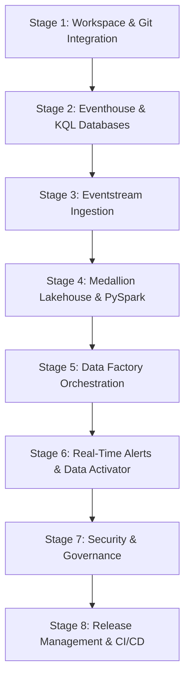

# Microsoft Fabric Platform Integration & Git Operations Guide

This guide serves as the step-by-step operational runbook and implementation roadmap for the Microsoft Fabric Real-Time Intelligence and OneLake analytics platform. It documents how to deploy, configure, secure, and version-control each component using Fabric's native Git Integration.

---

# Roadmap Overview

The end-to-end integration is structured into eight distinct deployment stages:



---

## Stage 1: Microsoft Fabric Workspace & Git Integration Setup

### 1. What We Are Building
An enterprise Microsoft Fabric Workspace linked directly to our GitHub repository. We will configure it to isolate and track all no-code configurations and code-based Fabric items inside a dedicated repository subdirectory.

### 2. Why the Step is Necessary
Git integration ensures that all workspace modifications (e.g., KQL tables, Eventstream ingestion, notebooks, and pipelines) are version-controlled, auditable, and reproducible, preventing code drift between the cloud workspace and our local repository.

### 3. Where It Fits Within the Overall Architecture
This is the foundational lifecycle management layer. It spans the entire platform and provides the connection between local development tools and the Fabric tenant.

### 4. Exact Actions to Perform Inside Microsoft Fabric
1. Open the [Microsoft Fabric Portal](https://app.fabric.microsoft.com/).
2. Select **Workspaces** from the left-hand navigation pane and click **New workspace**.
3. Name the workspace `HydroGrow-Analytics-Dev`, select your Fabric capacity, and click **Apply**.
4. In the bottom-left corner of the workspace settings, click the gear icon to open **Workspace settings**.
5. Select **Git integration** from the side menu.
6. Connect your Git provider:
   * **Organization**: Select your organization or account.
   * **Repository**: `fabric-smart-farming-analytics`.
   * **Branch**: `main`.
   * **Git Subdirectory Path**: Enter `fabric` (this is critical to avoid root pollution).
7. Click **Connect and sync**. Fabric will synchronize and create the initial system-defined workspace structure in the repository.

### 5. How it Integrates with Git and Version Control
When synced, Fabric creates a `.sourcecontrol` directory and tracks workspace items in separate folders under the `/fabric/` subdirectory. Fabric creates `item.metadata.json` (defines type and ID) and `item.config.json` files for each synced workspace element.

### 6. What Files or Artifacts Should be Committed
* `/fabric/.sourcecontrol` (system-defined git connection settings)
* `/docs/fabric/setup-guide.md` (this guide)

### 7. Validation and Testing
1. Navigate to your workspace in the Fabric Portal and confirm that the Git status indicator in the top menu shows **Synced** (represented by a green checkmark).
2. Push a test documentation change from your local repository to GitHub. In the Fabric Workspace, click **Source control** in the top ribbon and verify that the pending commit appears as an incoming update.

### 8. Why Validation is Necessary
Verifying connection synchronization guarantees that workspace items created in the portal will sync cleanly to our GitHub branch, protecting subsequent development stages.

### 9. Expected Outputs and Deliverables
* An active, connected Microsoft Fabric workspace `HydroGrow-Analytics-Dev` tracking all items in the `/fabric` directory.

### 10. Appropriate Commit Message Title
`feat(fabric): configure workspace git integration mapping to fabric subdirectory`

---

## Stage 2: Eventhouse and KQL Databases Configuration

### 1. What We Are Building
A Microsoft Fabric Eventhouse containing a KQL Database to ingest high-frequency IoT streaming telemetry. We will define schemas for our streaming event tables.

### 2. Why the Step is Necessary
Eventhouses are highly optimized time-series platforms. They allow sub-second indexing and query response times over millions of telemetry records, enabling real-time anomaly detection and low-latency dashboards.

### 3. Where It Fits Within the Overall Architecture
This sits in the **Operational Real-Time Analytics** path. It is the destination for the Eventstream and the query source for live Power BI dashboards.

### 4. Exact Actions to Perform Inside Microsoft Fabric
1. In your Fabric workspace, click **+ New item** and select **Eventhouse**.
2. Name the Eventhouse `SmartFarmingEventhouse` and click **Create**.
3. Under the newly created Eventhouse, select **New KQL Database**. Name it `SmartFarmingKQLDB`.
4. Open the KQL Query editor and run the complete clean deployment KQL table creation queries from [`config/fabric/kql-table-schemas.kql`](file:///c:/Users/iosep/Github%20Repositories/fabric-realtime-retail-monitoring/config/fabric/kql-table-schemas.kql).
5. If dropping existing tables for a clean deployment, run:
   ```kql
   .drop tables (EquipmentTelemetry, EnvironmentalTelemetry, CropLifecycle, CropTelemetry, IrrigationTelemetry, LightingTelemetry, MaintenanceActivity, FacilityOperations) ifexists
   ```

### 5. How it Integrates with Git and Version Control
Fabric serializes the KQL database definitions under:
`/fabric/SmartFarmingKQLDB.KQLDatabase/`
This includes the database properties and the database script definitions.

### 6. What Files or Artifacts Should be Committed
* `/fabric/SmartFarmingKQLDB.KQLDatabase/item.metadata.json`
* `/fabric/SmartFarmingKQLDB.KQLDatabase/item.config.json`
* `/config/fabric/kql-table-schemas.kql` (the SQL/KQL definitions for backup)

### 7. Validation and Testing
1. In the KQL Database menu, select **Databases** $\rightarrow$ **SmartFarmingKQLDB** $\rightarrow$ **Tables**.
2. Run a lookup query to verify the tables are empty and ready for data:
   ```kql
   EquipmentTelemetry | count
   ```
   *Expected Output*: `0` records.

### 8. Why Validation is Necessary
Validating table schemas prevents parsing failures during event stream ingestion.

### 9. Expected Outputs and Deliverables
* A KQL database containing three empty, pre-configured tables: `EquipmentTelemetry`, `EnvironmentalTelemetry`, and `CropLifecycle`.

### 10. Appropriate Commit Message Title
`feat(fabric): initialize KQL database schemas for operational telemetry`

---

## Stage 3: Real-Time Eventstream Ingestion (No-Code Custom App)

### 1. What We Are Building
A visual Fabric Eventstream setup consisting of a **Custom App HTTP Source** that exposes an HTTPS endpoint, with routing rules linking the source to KQL Database tables.

### 2. Why the Step is Necessary
Eventstreams buffer incoming telemetry, handle packet validation, and distribute events dynamically to multiple targets (KQL database for operations, OneLake Lakehouse for history) in parallel without requiring custom routing code.

### 3. Where It Fits Within the Overall Architecture
This is the core ingestion gateway. It connects the Python simulator client with all Microsoft Fabric data repositories.

### 4. Exact Actions to Perform Inside Microsoft Fabric
1. In your workspace, click **+ New item** and select **Eventstream**.
2. Name it `FarmingTelemetryEventstream` and click **Create**.
3. On the canvas design page, click **Add source** and select **Custom App**.
4. Name the source connection `SmartFarmSimulatorSource` and click **Add**.
5. Select the `SmartFarmSimulatorSource` node on the canvas to open the details pane. Copy the **ConnectionString** and **Event Hub URL** (HTTP POST ingestion endpoint).
6. Configure the routing destinations on the canvas:
   * Drag a connection from the source node to **Add destination** and select **KQL Database**.
   * Name the destination `EquipmentKQLTarget`, select the `SmartFarmingKQLDB` database, and select the `EquipmentTelemetry` table. Set the data format to **JSON**.
   * Add a routing rule filter: set it to ingest events where `event_type == 'equipment_telemetry'`.
   * Repeat this configuration for `EnvironmentalTelemetry` and `CropLifecycle` destinations, pointing to their respective tables with matching filters on `event_type`.

### 5. How it Integrates with Git and Version Control
Fabric automatically exports the Eventstream topology, metadata, and routing parameters into:
`/fabric/FarmingTelemetryEventstream.Eventstream/`

### 6. What Files or Artifacts Should be Committed
* `/fabric/FarmingTelemetryEventstream.Eventstream/item.metadata.json`
* `/fabric/FarmingTelemetryEventstream.Eventstream/item.config.json`
* `/fabric/FarmingTelemetryEventstream.Eventstream/FarmingTelemetryEventstream.Eventstream.json`
* `/config/fabric/eventstream-routing-template.json`

### 7. Validation and Testing
1. Configure your local simulator `.env` file to use the copied endpoint URL:
   ```env
   EVENTSTREAM_ENDPOINT=https://<your-fabric-eventstream-endpoint>/zip/ingest
   ```
2. Start the simulator:
   ```powershell
   python -m smart_farming.main
   ```
3. Check the Eventstream Portal canvas to view the live input/output metrics graphs updating in real time.
4. Run a query in the KQL database to verify records are being written:
   ```kql
   EquipmentTelemetry | take 5
   ```

### 8. Why Validation is Necessary
Validating the end-to-end ingestion loop confirms that the simulator's REST client can authenticate and stream JSON packets cleanly to the cloud.

### 9. Expected Outputs and Deliverables
* An active, running Eventstream receiving events from the Python simulator and distributing them to KQL tables.

### 10. Appropriate Commit Message Title
`feat(fabric): build FarmingTelemetryEventstream with Custom App source routing`

---

## Stage 4: Medallion OneLake Lakehouse & PySpark Spark Processing

### 1. What We Are Building
A Microsoft Fabric OneLake Lakehouse to host our historical data platform, structured using the standard Medallion architecture (Bronze, Silver, Gold). We will deploy a Spark Notebook to run transformations.

### 2. Why the Step is Necessary
While KQL serves short-term operational telemetry, historical analytics require optimized, long-term parquet-backed Delta tables to build reporting models, load data warehouses, and execute ML analytics.

### 3. Where It Fits Within the Overall Architecture
This represents the **Historical Business Analytics** pipeline. It takes raw files in OneLake and builds clean analytical tables.

### 4. Exact Actions to Perform Inside Microsoft Fabric
1. In your workspace, click **+ New item** and select **Lakehouse**. Name it `SmartFarmingLakehouse` and click **Create**.
2. Ensure the Eventstream also writes events to the Lakehouse Bronze directory:
   * In `FarmingTelemetryEventstream`, add a **Lakehouse destination** node.
   * Point it to `SmartFarmingLakehouse`, selecting the raw files path (`Files/bronze/raw_telemetry/`).
3. Click **+ New item** and select **Notebook**. Name it `MedallionTransformations`.
4. Connect the notebook to `SmartFarmingLakehouse`.
5. Write the PySpark code to read Bronze Delta tables, clean data (parse types, deduplicate), and write to Silver/Gold Delta tables:
   ```python
   # Read raw bronze files
   df_bronze = spark.read.json("Files/bronze/raw_telemetry/*.json")

   # Clean and filter to create Silver Equipment table
   from pyspark.sql.functions import col, to_timestamp

   df_silver_equipment = df_bronze.filter(col("event_type") == "equipment_telemetry") \
       .withColumn("timestamp", to_timestamp(col("timestamp"))) \
       .select(
           col("event_id"), col("facility_id"), col("zone_id"), 
           col("equipment_id"), col("equipment_type"), col("operating_status"), 
           col("health").cast("double"), col("current_load").cast("double"), 
           col("timestamp")
       ).dropDuplicates(["event_id"])

   # Write to Silver Delta Table
   df_silver_equipment.write.format("delta").mode("overwrite").saveAsTable("silver_equipment")
   ```

### 5. How it Integrates with Git and Version Control
Fabric synchronizes the notebook code natively as a python file or Jupyter notebook structure:
`/fabric/MedallionTransformations.Notebook/`
And the Lakehouse definition:
`/fabric/SmartFarmingLakehouse.Lakehouse/`

### 6. What Files or Artifacts Should be Committed
* `/fabric/MedallionTransformations.Notebook/item.metadata.json`
* `/fabric/MedallionTransformations.Notebook/MedallionTransformations.py`
* `/fabric/SmartFarmingLakehouse.Lakehouse/item.metadata.json`

### 7. Validation and Testing
1. In the Notebook editor, click **Run all** to execute the pipeline.
2. Verify that the table view of the Lakehouse shows the newly created `silver_equipment` Delta table.
3. Query the Delta table using Spark SQL:
   ```python
   spark.sql("SELECT COUNT(*) FROM silver_equipment").show()
   ```

### 8. Why Validation is Necessary
This ensures that the PySpark scripts can read raw telemetry schema structures, apply cleaning filters, and update the Delta Lake layer without data loss or type coercion failures.

### 9. Expected Outputs and Deliverables
* A Lakehouse containing raw bronze telemetry files and structured Silver Delta tables (`silver_equipment`).

### 10. Appropriate Commit Message Title
`feat(fabric): build MedallionTransformations PySpark notebook for Silver tables`

---

## Stage 5: Data Factory Orchestration

### 1. What We Are Building
A Microsoft Fabric Data Factory Pipeline to automate and orchestrate our Spark Notebook transformation stages on a recurring schedule.

### 2. Why the Step is Necessary
Orchestration ensures that Bronze data is regularly processed and loaded into Silver and Gold layers, providing data updates for downstream reports.

### 3. Where It Fits Within the Overall Architecture
This represents the orchestration and scheduler engine. It controls execution dependencies and scheduling for the Medallion transformation jobs.

### 4. Exact Actions to Perform Inside Microsoft Fabric
1. In your workspace, click **+ New item** and select **Data Pipeline**. Name it `OrchestrationPipeline` and click **Create**.
2. In the design canvas, select **Activities** $\rightarrow$ **Notebook**.
3. Drag the Notebook activity onto the canvas, name it `ExecuteMedallionNotebook`, and configure its settings:
   * **Notebook**: Select `MedallionTransformations`.
4. Click the schedule icon in the top toolbar to configure execution settings:
   * Set the trigger type to **Schedule**.
   * Select a daily recurrence interval (e.g., execute every day at `02:00 AM UTC`).
5. Click **Save** and select **Run** to test the pipeline execution immediately.

### 5. How it Integrates with Git and Version Control
The Data Pipeline canvas, activities configuration, and execution properties are exported into:
`/fabric/OrchestrationPipeline.DataPipeline/`

### 6. What Files or Artifacts Should be Committed
* `/fabric/OrchestrationPipeline.DataPipeline/item.metadata.json`
* `/fabric/OrchestrationPipeline.DataPipeline/item.config.json`
* `/fabric/OrchestrationPipeline.DataPipeline/pipeline-content.json`

### 7. Validation and Testing
1. Open the Data Pipeline workspace view and click **Monitoring** $\rightarrow$ **Pipeline runs**.
2. Select the latest execution run and verify that all stages complete with a status of **Succeeded**.

### 8. Why Validation is Necessary
Orchestrator validation guarantees that scheduler triggers execute without permission issues or timeout failures in production.

### 9. Expected Outputs and Deliverables
* An active, scheduled Data Pipeline automating daily data updates into Silver and Gold tables.

### 10. Appropriate Commit Message Title
`feat(fabric): create Data Factory orchestration pipeline schedule`

---

## Stage 6: Real-Time Alerts & Monitoring (Data Activator)

### 1. What We Are Building
A Data Activator Reflex setup configured to evaluate environmental telemetry in real time and trigger notifications when values drift outside operating safety thresholds.

### 2. Why the Step is Necessary
Vertical farming crops are highly sensitive to microclimate shifts. If the climate controller fails, a temperature spike can destroy crop yields. Automated alerting provides immediate warning to operation teams.

### 3. Where It Fits Within the Overall Architecture
This resides in the **Proactive Operations** path. It consumes live telemetry from the Eventhouse database and outputs alerts to team channels.

### 4. Exact Actions to Perform Inside Microsoft Fabric
1. Open your KQL Database `SmartFarmingKQLDB` and view the `EnvironmentalTelemetry` table.
2. Select **Set Alert** from the KQL database options pane to open Data Activator.
3. Configure the trigger rules:
   * **Trigger Name**: `HighTemperatureReflex`.
   * **Monitor Variable**: `sensor_value` where `sensor_type == 'air_temperature'`.
   * **Condition**: If `sensor_value` is **greater than** `28.0` °C.
   * **Time Window**: Evaluated over the last `1 minute`.
4. Configure the output action:
   * Select **Send Email** (or Microsoft Teams message).
   * Enter the destination email address and set the message subject to:
     `WARNING: High Temperature Detected at Facility {facility_id}`.
5. Click **Start** to activate the Reflex trigger.

### 5. How it Integrates with Git and Version Control
Data Activator Reflex items, triggers, thresholds, and webhook notification mappings are exported under:
`/fabric/HighTemperatureReflex.Reflex/`

### 6. What Files or Artifacts Should be Committed
* `/fabric/HighTemperatureReflex.Reflex/item.metadata.json`
* `/fabric/HighTemperatureReflex.Reflex/item.config.json`

### 7. Validation and Testing
1. Configure your local simulator settings to temporarily override and inject a temperature anomaly (e.g., set temp baseline to `30.0` °C).
2. Run the simulator.
3. Verify that the Data Activator dashboard shows the trigger threshold being breached.
4. Confirm receipt of the alert email/notification within 15 seconds.

### 8. Why Validation is Necessary
This confirms that the Eventstream-to-Reflex bridge evaluates events inside the target SLA window (< 15 seconds).

### 9. Expected Outputs and Deliverables
* An active Data Activator reflex trigger sending warnings when environmental boundaries are breached.

### 10. Appropriate Commit Message Title
`feat(fabric): configure Data Activator reflex rule for climate warnings`

---

## Stage 7: Security, RBAC & Governance

### 1. What We Are Building
A secure Fabric workspace organization configuring Entra ID security groups, defining workspace permissions, and setting up KQL Database Row-Level Security (RLS).

### 2. Why the Step is Necessary
Smart farming operational details are sensitive. We must ensure that only authorized facilities can view local asset states and that dashboard developers cannot view restricted business statistics.

### 3. Where It Fits Within the Overall Architecture
This security layer encompasses all ingestion endpoints, KQL tables, Spark tables, and reports, protecting the platform from unauthorized modifications.

### 4. Exact Actions to Perform Inside Microsoft Fabric
1. In your workspace settings, select **Access**.
2. Assign roles according to the principle of least privilege:
   * **Data Engineers (Admin)**: Full control over items, pipelines, and Git synchronization.
   * **Dashboard Creators (Contributors)**: Can read datasets and build reports but cannot write or modify tables.
   * **Facility Managers (Viewer)**: Read-only access to finished reports.
3. Open `SmartFarmingKQLDB` and run the KQL commands to configure Row-Level Security:
   * Establish a query that limits results based on user identity or client ID:
     ```kql
     // Define security mapping function
     .create-or-alter function TenantAccessPolicy(TenantId:string) {
         current_principal_is_member_of('aadgroup=Facility-' + TenantId)
     }
     ```

### 5. How it Integrates with Git and Version Control
Workspace access policies and role bindings are stored in the workspace metadata synced under `/fabric/`. Any SQL/KQL security functions are version-controlled inside the database script files.

### 6. What Files or Artifacts Should be Committed
* `/fabric/SmartFarmingKQLDB.KQLDatabase/item.config.json`

### 7. Validation and Testing
1. Authenticate with a test principal that is not a member of the Facility group.
2. Attempt to query the KQL database and verify that data queries return no results or an unauthorized message.

### 8. Why Validation is Necessary
Validating security controls prevents data leaks and ensures compliance with enterprise governance models.

### 9. Expected Outputs and Deliverables
* A role-secured Microsoft Fabric workspace preventing unauthorized schema modifications and data access.

### 10. Appropriate Commit Message Title
`security(fabric): implement role access controls and database security policies`

---

## Stage 8: Release Management & CI/CD Pipelines

### 1. What We Are Building
A Microsoft Fabric Deployment Pipeline configured with three stages (**Dev**, **Test**, **Prod**) to automate release promotions across environments.

### 2. Why the Step is Necessary
Manual modifications in production databases lead to configuration drift and downtime. A deployment pipeline automates validation checks and ensures schema changes migrate cleanly.

### 3. Where It Fits Within the Overall Architecture
This is the final application delivery stage. It manages the migration of Eventstream, KQL Databases, and Lakehouse items from development workspaces to target production environments.

### 4. Exact Actions to Perform Inside Microsoft Fabric
1. Open the left-hand navigation menu in Microsoft Fabric and select **Deployment pipelines**.
2. Click **Create pipeline**. Name it `SmartFarmingReleasePipeline` and click **Create**.
3. Configure the three stages:
   * **Development**: Link to `HydroGrow-Analytics-Dev` workspace.
   * **Test**: Create and link a new workspace named `HydroGrow-Analytics-Test`.
   * **Production**: Create and link a new workspace named `HydroGrow-Analytics-Prod`.
4. Click **Deploy** to promote all Stage 1–7 items from Development to the Test workspace.
5. Setup deployment rules (such as pointing the Test Eventstream Custom App source node to the Test database endpoint).

### 5. How it Integrates with Git and Version Control
The pipeline configuration is saved as system-defined deployment settings. In GitHub, we configure a GitHub Actions workflow to run code checks on `/fabric/` items whenever a pull request is merged to the `main` branch.

### 6. What Files or Artifacts Should be Committed
* `.github/workflows/fabric-ci.yml` (automated code checks for Spark notebooks and database script formats).

### 7. Validation and Testing
1. Make a minor modification to a KQL script in the Development workspace.
2. Open the Deployment Pipeline and verify that it flags the Test environment as **Out of sync**.
3. Click **Deploy** to promote the change, and verify that the Test workspace updates automatically.

### 8. Why Validation is Necessary
This ensures that schema migrations do not drop active data or break ingestion streams during deployments.

### 9. Expected Outputs and Deliverables
* A multi-stage release pipeline managing workspace migrations across Dev, Test, and Prod.

### 10. Appropriate Commit Message Title
`ci(fabric): initialize deployment pipelines and Github workflow validation`
